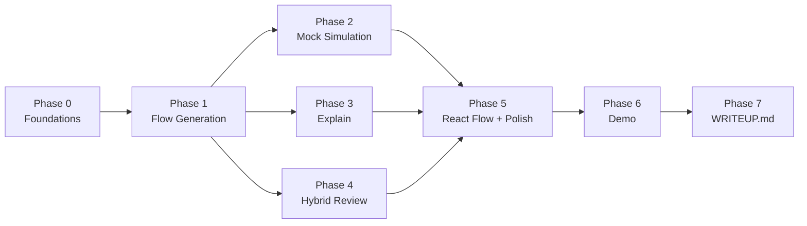

# Wati Automation Builder Copilot — 构建执行方案

> 本文档是 **内部执行计划**，不是产品/架构 reference。
> 产品规格见 [PRODUCT.md](./PRODUCT.md)；架构与数据模型见 [docs/](./docs/)。
> 每个 Phase 末尾会标注"调用 agile-micro-team SKILL 的时机"，跑 [.cursor/skills/agile-micro-team/SKILL.md](./.cursor/skills/agile-micro-team/SKILL.md)。

---

## 0. 现状 snapshot

> 截至 Phase 5 收官（2026-05-23）。Phases 0–5 全部 ship-ready，剩余 Phase 6（Demo）+ Phase 7（WRITEUP）。

**Phases 已完成（按时间顺序）**

| Phase       | 主题                   | 关键交付                                                                                                                                                                                                                                                                                                                                                                                                                                                                                                               | 自动化测试            |
| ----------- | ---------------------- | ---------------------------------------------------------------------------------------------------------------------------------------------------------------------------------------------------------------------------------------------------------------------------------------------------------------------------------------------------------------------------------------------------------------------------------------------------------------------------------------------------------------------- | --------------------- |
| **0**       | Foundations            | `pnpm` 11 monorepo · TypeScript 5.6 strict · Fastify 5 + Pino + Zod config · Vite 5 + React 19 三栏 UI · ESLint / Prettier / Husky / Vitest · `/health` 通                                                                                                                                                                                                                                                                                                                                                             | 工程基线              |
| **1 + 1.5** | Flow Generation        | shared schema（`Flow` / `Node` / `Edge` / `Trigger` / `Message` / `Session`）· `inMemoryStore` · `FlowAgent` + DeepSeek 适配器 + Mock provider · `POST /api/flows/generate` · `GET /api/flows/:id` · 错误分层（`AppError` / `EnvValidationError`）                                                                                                                                                                                                                                                                     | shared + server + web |
| **2**       | Mock Simulation        | `SimulationEventSchema` · `branchMatcher` · 7 个 `nodeHandlers` · `FlowExecutor`（caps、retry、fallback、handoff）· `POST /simulate/start` / `:id/step` / `:id/reset` · ChatPanel + auto-start UX · ESLint 不变量 `executor ↛ llm/agents`                                                                                                                                                                                                                                                                              | + 28 server + 9 web   |
| **3**       | Explain                | `ReviewAgent.explain` + LLM prompt + 校验 · `POST /api/flows/:id/explain` · 多层 LLM 输出验证（长度、JSON 误嵌、retry）· `react-markdown` 渲染 · FlowPanel Explain block · `ExplainStatus` + AbortController + refresh UX                                                                                                                                                                                                                                                                                              | + 13 server + 16 web  |
| **4**       | Hybrid Review          | 5 条 structural rules（`MISSING_ENTRY` / `UNREACHABLE_NODE` / `MISSING_FALLBACK` / `DUPLICATE_CONDITION` / `DANGLING_EDGE`）· `ReviewAgent.review`（semantic codes：`MISSING_BRANCH` / `AMBIGUOUS_ROUTING` / `UNCLEAR_QUESTION`）· `mergeIssues` 按 `nodeId` 去重（structural wins）· `POST /api/flows/:id/review` 用 `Promise.allSettled` 并行 + graceful degrade（`SEMANTIC_REVIEW_UNAVAILABLE`）· `IssueList` 组件 + mutex with Explain · ESLint 不变量 `validator ↛ llm/agents` · `env.ts` `optionalNonEmpty` 修复 | + 47 server + 19 web  |
| **5**       | React Flow + UI polish | `@dagrejs/dagre` 自动布局 · `computeLayout` 纯函数 · 单一参数化 `NodeCard` + 7 种类型样色 · `FlowGraph` 容器（read-only，prop-driven selection + zoom-to-fit）· FlowPanel `Graph / JSON` 切换（Graph 默认）· `IssueList` 卡片可选中 + `aria-pressed`，issue ↔ node 联动高亮 · 三栏 `min-width` + selected outline · `vitest.setup.ts` 提供 ReactFlow happy-dom polyfills                                                                                                                                               | + 37 web              |
| **review**  | Pre-demo hardening     | (1) chat 失败时保留 transcript（inline banner）· (2) `FlowGraph` / `react-markdown` 改用 `React.lazy` → 初始 JS 从 189 KB gz 降到 36 KB gz · (3) README / BUILD_PLAN / data-model / PRODUCT 全部更新到 Phase 5 现状 · (4) `.github/workflows/ci.yml`（typecheck / lint / test / build）· (5) `packages/server/scripts/simulation-smoke.ts` 作为 `pnpm --filter server simulation-smoke` 暴露                                                                                                                           | + 4 web               |

**当前测试体量**

- `shared`：73
- `server`：199
- `web`：150
- **总计：422** —— 全绿，每个 phase 末尾 QA artifact 都记录了 AC 检查、smoke evidence、design notes。

**仍未做（Phase 6 / 7）**

- Phase 6：3 条 demo prompt 锁定 · storyboard · dry-run · 录屏 · 上传
- Phase 7：`WRITEUP.md` 提交

---

## 1. 路径概览



- **Phase 0** 是地基，无 user-facing feature，不跑 agile cycle，TL+Dev 直推。
- **Phase 1-5** 每个都是一个 feature，跑完整的 `BA → UX → TL → Dev → QA`，每个 phase 内标注 SKILL 调用点。
- **Phase 2 / 3 / 4** 在依赖关系上都只依赖 Phase 1（已生成的 flow），技术上可以并行；但执行上建议**串行**，避免上下文切换。
- **Phase 6 / 7** 是交付，不再产代码。

---

## 2. Phase 0 — Foundations

> 直推：基础设施不是 user-facing feature，跑全套 BA→QA 是 overkill。TL+Dev 自己做。

### 2.1 目标

把所有 feature 都依赖的"共享基础"做好：Zod schema、ID、in-memory store、错误处理、`/api` 路由前缀。完成后任何 feature 都能直接消费这些原语。

### 2.2 In / Out scope

| In                                                                                 | Out                                           |
| ---------------------------------------------------------------------------------- | --------------------------------------------- |
| Flow / Node (discriminated union) / Edge / Session / Message / Issue 的 Zod schema | 任何 endpoint 业务逻辑                        |
| 派生 TS 类型（`z.infer`）                                                          | LLMProvider（移到 Phase 1，第一次用到时引入） |
| ID 生成 helper                                                                     | FlowExecutor（Phase 2）                       |
| 内存 store + 一份单测                                                              | Structural validator（Phase 4）               |
| 统一 error shape + Fastify error handler                                           |                                               |
| `/api` 路由前缀注册器                                                              |                                               |

### 2.3 任务清单

- [x] `packages/shared/src/schema/flow.ts` — `FlowSchema`（trigger / nodes / edges / entryNodeId / ...，含 11 个单测）
- [x] `packages/shared/src/schema/node.ts` — `NodeSchema = z.discriminatedUnion('type', [...])`，覆盖 7 种节点类型（含 20 个单测）
- [x] `packages/shared/src/schema/edge.ts` — `EdgeSchema`（slice 0.2 完成）
- [x] `packages/shared/src/schema/session.ts` — `SessionSchema` / `SessionStatusEnum`（含 7 个单测；`message.ts` 已在 slice 0.2 完成）
- [x] `packages/shared/src/schema/issue.ts` — `IssueSchema` + `IssueCodeEnum`（含单测）
- [x] `packages/shared/src/schema/edge.ts` — `EdgeSchema`（拒绝 self-loop，含单测）
- [x] `packages/shared/src/schema/message.ts` — `MessageSchema`（discriminated union `bot`/`user`，含单测）
- [x] `packages/shared/src/schema/trigger.ts` — `TriggerSchema`（discriminated union `new_message`/`keyword`，含单测）
- [x] `packages/shared/src/schema/index.ts` — barrel；`packages/shared/src/index.ts` re-export `./ids` + `./schema`
- [x] `packages/shared/src/ids.ts` — `newFlowId()` / `newSessionId()` / `newNodeId()` / `newEdgeId()` / `newMessageId()` / `newIssueId()`（nanoid 实现，含单测）
- [x] `packages/server/src/store/inMemoryStore.ts` — `InMemoryStore` 类
- [x] `packages/server/src/store/inMemoryStore.test.ts` — round-trip 单测（9 个 case）
- [x] `packages/server/src/errors.ts` — `AppError` + 共享 error shape + Fastify error handler（4 个单测 + 集成）
- [x] `packages/server/src/routes/index.ts` — `registerApiRoutes`，注册 `/api` 前缀
- [x] `packages/server/src/app.ts` — `buildApp({ loggerInstance? })` 工厂，串起 error handler / CORS / health / `/api`（2 个集成 smoke）
- [x] `packages/server/src/index.ts` — 用 `buildApp()`，仅负责监听端口与启动日志
- [x] 给 `packages/shared/package.json` 加 `nanoid` 依赖（slice 0.1）

### 2.4 关键 API 轮廓

```ts
// packages/shared/src/schema/index.ts
export const FlowSchema = z.object({
  id: z.string(),
  name: z.string(),
  prompt: z.string(),
  trigger: z.object({ type: z.enum(['new_message', 'keyword']), value: z.string().optional() }),
  entryNodeId: z.string(),
  nodes: z.array(NodeSchema),
  edges: z.array(EdgeSchema),
  createdAt: z.string().datetime(),
});
export type Flow = z.infer<typeof FlowSchema>;
export type Node = z.infer<typeof NodeSchema>;
export type Edge = z.infer<typeof EdgeSchema>;
export type Session = z.infer<typeof SessionSchema>;
export type Issue = z.infer<typeof IssueSchema>;

// packages/shared/src/ids.ts
export const newFlowId = (): string => `flow_${nanoid()}`;
export const newSessionId = (): string => `sess_${nanoid()}`;

// packages/server/src/store/inMemoryStore.ts
export class InMemoryStore {
  saveFlow(flow: Flow): void;
  getFlow(id: string): Flow | undefined;
  saveSession(session: Session): void;
  getSession(id: string): Session | undefined;
}

// packages/server/src/errors.ts
export type ErrorCode =
  | 'INVALID_INPUT'
  | 'FLOW_NOT_FOUND'
  | 'SESSION_NOT_FOUND'
  | 'LLM_OUTPUT_INVALID'
  | 'LLM_UNAVAILABLE';

export class AppError extends Error {
  constructor(
    public code: ErrorCode,
    message: string,
    public statusCode: number,
  ) {
    super(message);
  }
}
```

### 2.5 SKILL 调用时机

**不调用。** 基础设施直推。

### 2.6 验收

- [x] `pnpm typecheck` 全绿
- [x] `pnpm test` 全绿（shared 67 + server 15 = **82 个测试**）
- [x] `GET /health` 在 `/api` 前缀挂载后仍然返回 200（`app.test.ts` 覆盖）
- [x] 临时 `/api` 路由抛 `AppError` / `ZodError` / 未知 Error，error handler 分别返回 statusCode + `{ error: { code, message } }`（`errors.test.ts` 覆盖）

### 2.7 预计 commit 数

3–4 个：

1. `chore(shared): add Zod schemas for Flow / Session / Issue`
2. `chore(shared): add ID generation helpers`
3. `chore(server): add InMemoryStore + error middleware + /api prefix`
4. `test(server): cover InMemoryStore round-trip`

---

## 3. Phase 1 — Flow Generation `[agile-micro-team]`

### 3.1 目标

用户在 Prompt 面板输入自然语言描述，点 Generate，DeepSeek 生成 Wati-style flow JSON，存进 store，前端展示。

### 3.2 In / Out scope

| In                                                         | Out                           |
| ---------------------------------------------------------- | ----------------------------- |
| `LLMProvider` interface + `DeepSeekProvider` + factory     | React Flow 图（Phase 5）      |
| `FlowAgent`：prompt → LLM → Zod parse → 1 次 retry         | 流式响应（V2）                |
| `POST /api/flows/generate`                                 | 多 prompt 历史 / 模板库（V2） |
| `GET /api/flows/:id`                                       |                               |
| Web：Prompt 面板接 textarea + Generate，Flow 面板展示 JSON |                               |
| Vitest：FlowAgent + mock LLM                               |                               |

### 3.3 任务清单

- [x] `packages/server/src/llm/types.ts` — `LLMProvider` interface + `LLMMessage` / `LLMCompleteOptions` 类型（T1）
- [x] `packages/server/src/llm/mock.ts` — `MockLLMProvider`（队列 + `callCount` + Error 注入；含 6 个单测）
- [x] `packages/server/src/llm/factory.ts` — `createLLMProvider({ provider })`，`mock` 分支已实现，`deepseek` 留给 T2（含 3 个单测）
- [x] `packages/server/src/llm/deepseek.ts` — DeepSeek 适配器（OpenAI-兼容 chat completions；DI 友好 `fetch`；Zod 校验响应；AbortController 超时；含 12 个单测）
- [x] `packages/server/src/agents/flowAgent.ts` — `FlowAgent.generate(prompt)`；`FlowDraftSchema = FlowSchema.omit({id,prompt,createdAt})`；transport 错 → 502 不重试；JSON/Zod 错 → retry → 422；空 prompt → 400 不调 LLM
- [x] `packages/server/src/agents/flowAgent.prompt.ts` — system prompt（7 种 node 契约 + fallback 边规则）
- [x] `packages/server/src/agents/flowAgent.test.ts` — 13 个单测覆盖 happy path / `stripFences` / AC3 / AC4 / AC5 / maxRetry 边界 / 输入校验
- [x] `packages/server/src/routes/flows.ts` — `POST /api/flows/generate`（body Zod 校验：`prompt.trim().min(1)`；agent + store DI；10 个路由单测覆盖 200 / 400 五类输入 / 422 / 502 / 500）
- [x] `packages/server/src/routes/flows.ts` — `GET /api/flows/:id`（params Zod 校验；store.getFlow → 404 FLOW_NOT_FOUND；3 个单测：200 命中 / 404 未命中 / POST→GET round-trip）
- [x] `packages/server/src/env.ts` + `packages/server/src/config.ts` — 抽出 `parseEnv` 可测函数；`LLM_API_KEY` 在 `NODE_ENV !== 'test' && LLM_PROVIDER !== 'mock'` 时 required（含 12 个单测；`.env.example` + README 同步更新）
- [x] `packages/web/src/api.ts` — typed fetch wrappers（`generateFlow`, `getFlow`）；`ApiClient` class（注入 fetch）+ `ApiError`（code / message / status）+ singleton + standalone exports；响应用 `FlowSchema.safeParse` 防版本漂移；12 个单测覆盖 200 / 400 / 422 / 502 / 404 / NETWORK_ERROR / INVALID_RESPONSE / id 编码 / signal 透传
- [x] `packages/web/src/panels/PromptPanel.tsx` — textarea + Generate button + 3 个 starter prompts；6 个 RTL 单测覆盖输入 / 提交 / 禁用 / starter 填充
- [x] `packages/web/src/panels/FlowPanel.tsx` — `AppStatus` discriminated union 渲染 idle / generating / ready (JSON pretty) / error (alert)；4 个 RTL 单测覆盖四个分支
- [x] `packages/web/src/state.ts` — 抽出 `AppStatus` + `AppErrorSummary` 让 App / FlowPanel 共享
- [x] `packages/web/src/App.tsx` — `useState<AppStatus>` 状态机 + `AbortController` 在 unmount 清理；6 个 RTL 单测覆盖 idle / success / in-flight / ApiError 映射 / unknown error 兜底 / unmount abort
- [x] `packages/web/vitest.config.ts` — `globals: true`（让 RTL auto-cleanup 起效）+ 每个 UI 测试文件用 `// @vitest-environment happy-dom`
- [x] `packages/web/src/styles.css` — Prompt 输入 / 提交按钮 / Starter 列表 / Flow JSON pretty / 错误条样式

### 3.4 关键 API 轮廓

```ts
// packages/server/src/llm/types.ts
export interface LLMProvider {
  complete(opts: {
    messages: Message[];
    jsonSchema?: object;
    timeoutMs?: number;
  }): Promise<string>;
}

// packages/server/src/agents/flowAgent.ts
export class FlowAgent {
  constructor(private provider: LLMProvider, private store: InMemoryStore);
  async generate(prompt: string): Promise<Flow>;   // throws AppError(422 | 502)
}

// Routes
POST /api/flows/generate  { prompt: string }              -> 200 { flow }
GET  /api/flows/:id                                       -> 200 { flow } | 404
```

### 3.5 SKILL 调用时机

| Checkpoint | 时机         | 重点                                                                                                                                                         |
| ---------- | ------------ | ------------------------------------------------------------------------------------------------------------------------------------------------------------ |
| BA         | phase 开始时 | user story / In-Out vs MVP / AC（Given LLM 合规 JSON、When 调 generate、Then 200 + Zod 校验通过）/ Must/Should/Could                                         |
| TL         | BA 完成后    | 切片到 `shared`（无变更）、`server`（`llm/` `agents/` `routes/` `config 改 required`）、`web`（`api.ts` 两个面板）。风险：DeepSeek prompt 设计与 JSON 稳定性 |
| QA         | Dev 完成后   | 跑 buyer/seller prompt 拿到合规 flow；mock LLM 故意返回非法 JSON → 验 422；mock timeout → 验 502                                                             |

### 3.6 验收

```bash
# happy
curl -sX POST http://localhost:3000/api/flows/generate \
  -H "Content-Type: application/json" \
  -d '{"prompt":"When a new contact messages us, ask if they are a buyer or seller. Route buyers to sales."}' \
  | jq .

# -> 200 { flow: { id: "flow_...", name, prompt, trigger, entryNodeId, nodes: [...], edges: [...], createdAt } }

# 不存在
curl -sX GET http://localhost:3000/api/flows/flow_nonexistent | jq .
# -> 404 { error: { code: "FLOW_NOT_FOUND", message: "..." } }
```

浏览器：输入 prompt → 点 Generate → Flow 面板显示完整 JSON（无图，Phase 5 才有图）。

### 3.7 预计 commit 数

5–6 个：

1. `feat(llm): add LLMProvider interface and DeepSeek adapter`
2. `chore(server): LLM_API_KEY required at boot`
3. `feat(agents): add FlowAgent with bounded retry on schema failure`
4. `test(agents): cover FlowAgent happy / retry / failure`
5. `feat(server): POST /api/flows/generate and GET /api/flows/:id`
6. `feat(web): wire Prompt panel to generate, Flow panel shows JSON`

### 3.8 QA artifact

#### AC checklist

| AC                                                          | Result   | Coverage / Notes                                                                                                                                                              |
| ----------------------------------------------------------- | -------- | ----------------------------------------------------------------------------------------------------------------------------------------------------------------------------- |
| AC1 valid prompt → 200 + `FlowSchema`                       | **Pass** | `flowAgent.test.ts` happy paths (MockLLMProvider preloaded) + `flows.test.ts` route happy path. E2E with real LLM blocked on missing dev key — see "Untested" below           |
| AC2 empty / missing / non-string prompt → 400 INVALID_INPUT | **Pass** | `flows.test.ts` 5 parametric cases + curl smoke (all 4 variants returned 400)                                                                                                 |
| AC3 LLM bad JSON ×2 → 422 LLM_OUTPUT_INVALID, 2 calls       | **Pass** | `flowAgent.test.ts` retry-exhausted case asserts `provider.callCount === 2` and `AppError(422)`                                                                               |
| AC4 retry valid → 200, 2 calls                              | **Pass** | `flowAgent.test.ts` retry-success case                                                                                                                                        |
| AC5 LLM transport error → 502, no retry                     | **Pass** | `flowAgent.test.ts` covers throw → `502 LLM_UNAVAILABLE`, `callCount === 1`; curl smoke (empty mock queue → 502) confirms                                                     |
| AC6 generate → store → GET returns same flow                | **Pass** | `flows.test.ts` round-trip case                                                                                                                                               |
| AC7 unknown id → 404 FLOW_NOT_FOUND                         | **Pass** | `flows.test.ts` + curl smoke (`flow_does_not_exist` → 404, code `FLOW_NOT_FOUND`)                                                                                             |
| AC8 missing `LLM_API_KEY` at boot → exit 1                  | **Pass** | `env.test.ts` Zod refinement + boot smoke (`NODE_ENV=production LLM_PROVIDER=deepseek` with no key → `Invalid environment configuration … LLM_API_KEY is required …`, exit 1) |
| AC9 empty prompt → Generate disabled                        | **Pass** | `PromptPanel.test.tsx` "disables Generate when blank"                                                                                                                         |
| AC10 success → loading → JSON in Flow panel                 | **Pass** | `App.test.tsx` "shows the generated flow JSON after a successful Generate click" + "in-flight progress hint"                                                                  |
| AC11 API error → inline error visible                       | **Pass** | `App.test.tsx` ApiError mapping + unknown error fallback; `FlowPanel` `role="alert"` with code + message                                                                      |

#### Smoke checklist (manual, against mock server on :3001)

- [x] `GET /health` → 200 with `status / uptime / timestamp`
- [x] `POST /api/flows/generate` with `{}` → 400 INVALID_INPUT
- [x] `POST /api/flows/generate` with `{"prompt":""}` → 400 INVALID_INPUT
- [x] `POST /api/flows/generate` with `{"prompt":"   "}` → 400 INVALID_INPUT (whitespace caught at body schema)
- [x] `POST /api/flows/generate` valid prompt against empty mock queue → 502 LLM_UNAVAILABLE
- [x] `GET /api/flows/flow_does_not_exist` → 404 FLOW_NOT_FOUND
- [x] Boot with `NODE_ENV=production LLM_PROVIDER=deepseek` and no key → exit 1 with env-validation message
- [ ] Boot with real `LLM_API_KEY` + DeepSeek → POST returns a real flow (deferred — no key in dev env)

#### Edge / negative cases verified

- 5 body-validation variants (missing key, empty body, empty string, whitespace, non-string)
- Retry exhausted vs retry-success (LLM mock with `[bad, bad]` and `[bad, good]` queues)
- Transport error never retries (`callCount === 1`)
- Unknown HTTP error from agent → 500 INTERNAL (fallback path in `errorHandler`)
- Web `ApiError` vs raw `Error` both surface as `role="alert"`
- App unmount during in-flight request → AbortController fires (`App.test.tsx`)

#### Issues found

1. **DEF-1 — Zod validation error body is the raw Zod array, not a user-friendly string.** **Closed (Phase 1.5)**
   - Steps: `POST /api/flows/generate` with `{}`
   - Was: `error.message = "[\n  {\n    \"code\": \"invalid_type\", … }]"`
   - Now: `error.message = "prompt: Required"` (single issue) or `"name: …; age: …"` (multiple, semicolon-joined, capped at 300 chars)
   - Fix: `flattenZodError` helper in `packages/server/src/errors.ts` + 2 new tests in `errors.test.ts`

2. **DEF-2 — Unmatched route 404s return Fastify's default error shape, not our `{ error: { code, message } }`.** **Closed (Phase 1.5)**
   - Steps: `GET /api/no-such-route`
   - Was: `{ "message": "Route GET:/api/no-such-route not found", "error": "Not Found", "statusCode": 404 }`
   - Now: `{ "error": { "code": "NOT_FOUND", "message": "Route GET:/api/no-such-route not found" } }`
   - Fix: `app.setNotFoundHandler` in `packages/server/src/app.ts` + `'NOT_FOUND'` added to `ErrorCode` union + 2 new tests in `app.test.ts` (one under `/api`, one outside)

#### Untested (acceptable gaps)

- **AC1 end-to-end with real DeepSeek** — no dev LLM key configured. The seam is exercised at every other layer (provider unit test with `fetch` mock, FlowAgent with `MockLLMProvider`, route with `StubAgent`, web `ApiClient` with stub `fetch`, App with mocked `./api` module). Risk: live prompt may produce subtly non-schema-conforming output. Mitigation: 1-retry already implemented; structural validator in Phase 4 catches lingering issues; prompt is small and tightly constrained.

#### Ship recommendation

**Demo-ready. Phase 1.5 hardening completed inline (Option B).**

- Phase 1 user-facing AC are all green.
- DEF-1 and DEF-2 closed in Phase 1.5; `errorHandler` + not-found-handler now uniform and contract-correct before Phase 2 builds on top.
- Final automated coverage: shared 67 + server 77 + web 28 = **172 tests** across 21 files; workspace typecheck + lint clean.

---

## 4. Phase 2 — Mock Simulation `[agile-micro-team]`

### 4.1 目标

用户对已生成的 flow 启动 mock 对话，输入 reply，bot 按确定性 FSM 走分支。**全程不调 LLM。**

### 4.2 In / Out scope

| In                                             | Out                                          |
| ---------------------------------------------- | -------------------------------------------- |
| `FlowExecutor` FSM（确定性，无 LLM 导入）      | 运行时 LLM 回复（永久禁止，per quality.mdc） |
| `POST /api/flows/:id/simulate/start`           | 流式输出（V2）                               |
| `POST /api/simulate/:sessionId/step`           | 真实 `api_call`（MVP 仅 mock）               |
| `POST /api/simulate/:sessionId/reset`          |                                              |
| Web：Mock Chat 面板（消息气泡、输入框、Reset） |                                              |
| Vitest：≥ 5 个 executor 边界用例               |                                              |

### 4.2.1 BA 决策（pre-Dev 已敲定）

| #   | 决策                                                                                                                                          |
| --- | --------------------------------------------------------------------------------------------------------------------------------------------- |
| 1   | **Retry 超限终态** = `handed_off`，bot 文案 `"Sorry, I couldn't understand. Transferring you to a human."`                                    |
| 2   | **Mock `api_call` 可视性** = **events only**，不在 transcript 加合成行（保持聊天体验干净；events 数组里有 `mock-api-call` 供前端展示 / 日志） |
| 3   | **分支匹配** = case-insensitive trim **完全相等**；substring / fuzzy 留给 V2                                                                  |
| 4   | **Reset 后** = **同 sessionId**；transcript 清空、`retryCount=0`、`currentNodeId=entryNodeId`、status `running` → auto-run                    |

### 4.3 任务清单（Slices，TDD）

- [x] **S1** `packages/shared/src/schema/simulationEvent.ts` — `SimulationEventSchema` discriminated union（5 种 type）+ barrel export + 5 个单测
- [x] **S2** `packages/server/src/executor/branchMatcher.ts` — 纯函数 `(reply, edges) → MatchResult`；铁律：case-insensitive trim 完全相等；8 个单测覆盖 exact / case / trim / fallback / none / 无 condition / 反 substring / 重复 condition
- [x] **S3** `packages/server/src/executor/nodeHandlers.ts` — 7 种节点 handler；`api_call` events-only / `wait` silent + instant / `condition` 透明 fork（exact / fallback / none / 无 reply 三态）；14 个单测一节点一组
- [x] **S4** `packages/server/src/executor/flowExecutor.ts` — `createSession / step / reset`；`structuredClone` 隔离 session；retry 计数 + handoff 兜底（`team: 'human'`）；100-step 上限抛 `INTERNAL 500`；可注入 `now()` 时钟；16 个单测覆盖 happy buyer / happy seller / case-insensitive / fallback / retry-exhaust / no-fallback / SESSION_NOT_FOUND / INVALID_INPUT 空/终态 / reset round-trip / api_call events-only / wait 无延迟 / cyclic flow trip cap
- [x] **S5** ESLint invariant：`executor/` ↛ `llm/` `agents/`（`no-restricted-imports`，pattern `**/llm/**` 与 `**/agents/**`；用反向 probe 验证 rule 触发）
- [x] **(bonus)** `packages/server/src/errors.ts` — `ErrorCode` union 加 `'INTERNAL'`（之前 `errorHandler` 兜底 emit 它但 union 没声明，是个轻微 drift；这次顺手补上）
- [x] **S6** `packages/server/src/routes/simulation.ts` — 3 端点；body / params Zod；DI executor + store；`app.ts` 注册；10 个 inject 测试（start 2 + step 4 + reset 2 + HTTP round-trip 1 + 1 extras within them）；HTTP smoke 4 条错误路径全部 `{ error: { code, message } }` 通过
- [x] **S7** `packages/web/src/api.ts` — `startSession` / `stepSession` / `resetSession` typed wrappers；`SessionEnvelopeSchema` Zod 校验响应；web 显式声明 `zod` dep；10 个新单测（每个 endpoint 3–4 用例）覆盖 happy / encode / 404 / 400 / abort / INVALID_RESPONSE
- [x] **S8** `packages/web/src/panels/ChatPanel.tsx` + `state.ts` `SimulationStatus` 独立子状态（sibling，不并入 AppStatus）+ `App.tsx` 自动 start session（`useEffect` watch flow.id）/ step / reset / abort-on-unmount；ChatPanel 9 个 RTL 单测；App 6 个新模拟测试（auto-start / step / 终态 / reset / step 错误 / starting hint）；`simStatusRef` 解决 useState updater 异步 race；`pnpm build` 通过 (web bundle 261 KB / gzip 77 KB)

### 4.4 关键 API 轮廓

```ts
// packages/server/src/executor/flowExecutor.ts
export class FlowExecutor {
  constructor(private store: InMemoryStore);
  createSession(flow: Flow): { session: Session; botMessages: string[] };
  step(sessionId: string, userMessage: string): {
    session: Session;
    botMessages: string[];
    events: SimulationEvent[];
  };
  reset(sessionId: string): { session: Session; botMessages: string[] };
}

export type SimulationEvent =
  | { type: 'branch'; from: string; to: string; condition?: string }
  | { type: 'fallback'; nodeId: string; reason: string }
  | { type: 'retry'; nodeId: string; count: number }
  | { type: 'mock-api-call'; nodeId: string; url?: string }
  | { type: 'handoff'; team: string };
```

### 4.5 SKILL 调用时机

| Checkpoint | 时机         | 重点                                                                                                                                                                                 |
| ---------- | ------------ | ------------------------------------------------------------------------------------------------------------------------------------------------------------------------------------ |
| BA         | phase 开始时 | AC 集中在 deterministic 行为（同 input 同 output）、fallback 路径、retry 上限（`SIMULATION_MAX_RETRY`）、status 转移（`running` / `waiting_for_input` / `handed_off` / `completed`） |
| TL         | BA 完成后    | 切片：`executor/`（核心，纯函数）→ `routes/simulation.ts` → `web/ChatPanel`。Invariant：executor 永不 import `llm/`。可加 ESLint `no-restricted-imports` 锁死                        |
| QA         | Dev 完成后   | 对 buyer/seller flow 跑 3 种回复：`buyer` / `seller` / `xyz`。验证 fallback 触发、reset 清空、Vitest 5+ edge 用例                                                                    |

### 4.6 验收

```bash
# start
SID=$(curl -sX POST http://localhost:3000/api/flows/$FLOW_ID/simulate/start | jq -r .session.id)

# step (happy)
curl -sX POST http://localhost:3000/api/simulate/$SID/step \
  -H "Content-Type: application/json" -d '{"message":"buyer"}' | jq .
# -> 200, session.status === 'handed_off', botMessages 含 "Routing you to Sales"

# step (unclear → fallback)
curl -sX POST http://localhost:3000/api/simulate/$SID/step -d '{"message":"hello"}' | jq .
# -> 200, events 含 { type: 'fallback' }

# reset
curl -sX POST http://localhost:3000/api/simulate/$SID/reset | jq .
# -> 200, transcript 清空
```

浏览器：聊天面板可连续输入；3 条路径都能演示。

### 4.7 预计 commit 数

5–7 个：

1. `feat(executor): add FlowExecutor FSM with node handlers`
2. `feat(executor): condition matcher and fallback`
3. `test(executor): cover buyer / seller / unclear / retry / unreachable`
4. `feat(server): simulation routes start / step / reset`
5. `feat(web): add ChatPanel with messages and reset`
6. `chore(executor): ESLint no-restricted-imports to lock invariant` _(可选)_

### 4.8 QA artifact

#### AC checklist

| AC                                                                                          | Result   | Coverage / Notes                                                                                                               |
| ------------------------------------------------------------------------------------------- | -------- | ------------------------------------------------------------------------------------------------------------------------------ |
| AC-S1 `start` 200 + `waiting_for_input` + 首问 botMessage                                   | **Pass** | `simulation.test.ts` "creates a session…" + QA smoke case #1                                                                   |
| AC-S2 `step "buyer"` → handed_off with `branch` + `handoff` events                          | **Pass** | `simulation.test.ts` buyer case + QA smoke case #2                                                                             |
| AC-S3 `step "seller"` → completed (send_message terminal)                                   | **Pass** | `simulation.test.ts` round-trip + QA smoke case #4                                                                             |
| AC-S4 Case-insensitive + trim match (`"  SELLER  "` ≡ `"seller"`)                           | **Pass** | `branchMatcher.test.ts` + QA smoke case #4 (verifies via real HTTP)                                                            |
| AC-S5 Fallback emits `fallback` event, retry++ emits `retry` event                          | **Pass** | `flowExecutor.test.ts` fallback + `nodeHandlers.test.ts` + QA smoke case #5 (r1 + r2)                                          |
| AC-S6 Retry exhausted → `handed_off` with `handoff.team === 'human'`                        | **Pass** | `flowExecutor.test.ts` retry-exhaust case + QA smoke case #5 (r3)                                                              |
| AC-S7 `reset` keeps same `sessionId`, clears transcript, `retryCount=0`                     | **Pass** | `simulation.test.ts` reset case + QA smoke case #3                                                                             |
| AC-S8 unknown flow / session → 404 with correct `code`                                      | **Pass** | `simulation.test.ts` 404 cases + QA smoke cases #6a, #6b + live TCP curl                                                       |
| AC-S9 empty / whitespace `message` → 400 INVALID_INPUT                                      | **Pass** | `simulation.test.ts` parametric + QA smoke case #6c                                                                            |
| AC-S10 Web auto-starts on `ready`, transcript visible, Reset works, terminal disables input | **Pass** | `App.test.tsx` 6 simulation tests + `ChatPanel.test.tsx` 9 tests; production bundle builds (`pnpm build`, 261 KB / gzip 77 KB) |
| AC-S11 Determinism: identical reply → identical events + botMessages                        | **Pass** | QA smoke case #7 (two fresh sessions, same input, deep-equal events + botMessages)                                             |
| AC-S12 Executor must not import `llm/` or `agents/`                                         | **Pass** | ESLint `no-restricted-imports` rule + reverse-probe verified during S5                                                         |
| AC-S13 `mock-api-call` produces an event, NOT a transcript line                             | **Pass** | `nodeHandlers.test.ts` api_call test + executor invariant                                                                      |

#### Smoke harness (`packages/server/scripts/simulation-smoke.ts`)

In-process `app.inject` harness boots the real Fastify pipeline with a stub agent + seeded buyer/seller flow and walks every canonical path. Reproducible:

```bash
env -u LLM_API_KEY LLM_PROVIDER=mock pnpm --filter server exec tsx scripts/simulation-smoke.ts
```

Result on 2026-05-23: `9/9 passed`. Cases:

1. start → 200, `waiting_for_input`, first bot message
2. step `buyer` → `handed_off` + `branch` + `handoff` events
3. reset → same `sessionId`, transcript trimmed, `retryCount = 0`, `waiting_for_input`
4. step `"  SELLER  "` (case + whitespace) → `completed` + support content
5. fallback → retry → exhaustion → `handed_off` with `team: 'human'`
6. Error contracts (unknown flow / unknown session / whitespace message) → 404 / 404 / 400 with `{ error: { code, message } }`
7. Determinism (same reply on two fresh sessions → identical events + botMessages)

#### Live-process smoke (real TCP)

```text
GET  /health                                   → 200 { status, uptime, timestamp }
OPTIONS /api/flows/.../simulate/start          → 204 with access-control-allow-origin: http://localhost:5173
POST /api/flows/flow_zzz/simulate/start        → 404 { error: { code: FLOW_NOT_FOUND, message } }
```

CORS preflight echoes the configured dev origin; no environment / port / framework regressions vs Phase 1.

#### Edge / negative cases verified

- `condition` node with no matching condition AND no fallback → `currentNodeId` does not move, retry increments (covered in `flowExecutor.test.ts`)
- Cyclic flow → 100-step auto-run cap throws `INTERNAL 500` (covered in `flowExecutor.test.ts`)
- Stepping a terminal session → 400 `INVALID_INPUT`
- `structuredClone` isolation: mutating returned session does not affect the store (covered in `flowExecutor.test.ts`)
- Web `useState` updater race: reading sessionId via a `simStatusRef` instead of the updater closure (caught during S8, see `App.tsx`)
- ChatPanel `name: /send/i` selector ambiguity with starter prompt text ("…sends 'support'…") — pinned to exact `name: 'Send'`

#### Issues found

None at QA time. Two minor design adjustments surfaced during Dev and were resolved inline:

- **D2-N1** `SessionEnvelope` was nearly placed in `shared` but kept in `packages/web` as an HTTP-boundary type (the server returns the shape inline; making it a shared contract would over-couple the server's route handler). Documented in `api.ts` header comment.
- **D2-N2** `simStatusRef` mirror added to `App.tsx`. React 18+ does not guarantee that `setSimStatus(updater)` runs the updater synchronously, so the original "let sessionId; setSimStatus(s => { sessionId = s…; return …; })" pattern was racy. Now reads from a `useEffect`-synced ref.

#### Untested (acceptable gaps)

- **Live DeepSeek integration into simulation** — Phase 2 explicitly does not call the LLM at runtime (invariant AC-S12). Real-LLM flow generation (Phase 1) feeding into simulation has been exercised only via stub agent in this QA; the contract between agent and executor is by-flow-id only, so the integration risk is mechanical at most.
- **Concurrent sessions per flow** — only single-session-per-flow exercised. The executor uses session-id-scoped state via the store, so this is a natural extension, but no concurrency test was added in Phase 2.
- **`wait` node timing** — runs silently and instantly (per BA decision); no real timer covered. If V2 implements real waits, retest.

#### Ship recommendation

**Phase 2 ship-ready. No defects to backlog.**

- 13/13 Phase 2 AC green; QA smoke 9/9; live TCP transport + CORS confirmed.
- Architecture invariant (`executor/` LLM-free) locked by ESLint and verified.
- Final automated coverage: shared 72 + server 125 + web 53 = **250 tests** across 27 files; workspace typecheck + lint + build all clean.
- Bundle size unchanged in spirit: web 261 KB / gzip 77 KB (chat panel + zod schema cost ≈ 7 KB gzipped over Phase 1 baseline).

---

## 5. Phase 3 — Explain `[agile-micro-team]`

### 5.1 目标

用户点 Flow 面板 Explain 按钮，`ReviewAgent.explain` 把已存 flow 转成人类可读的文字说明。

### 5.2 In / Out scope

| In                                       | Out                    |
| ---------------------------------------- | ---------------------- |
| `ReviewAgent.explain(flow)`              | Review 评审（Phase 4） |
| `POST /api/flows/:id/explain`            | 流式 explain（V2）     |
| Web：Flow 面板加 Explain 按钮 + 文本展示 |                        |
| Vitest：mock LLM 测 explain              |                        |

### 5.3 任务清单

- [ ] `packages/server/src/agents/reviewAgent.ts` — `ReviewAgent` 类，先只实现 `explain`
- [ ] `packages/server/src/agents/reviewAgent.prompt.ts` — explain 系统 prompt
- [ ] `packages/server/src/agents/reviewAgent.test.ts` — mock LLM 测 explain happy / 502
- [ ] `packages/server/src/routes/flows.ts` — 新增 `POST /api/flows/:id/explain`
- [ ] `packages/web/src/panels/FlowPanel.tsx` — Explain button + 结果块
- [ ] `packages/web/src/api.ts` — 新增 `explainFlow`

### 5.4 关键 API 轮廓

```ts
export class ReviewAgent {
  constructor(private provider: LLMProvider);
  async explain(flow: Flow): Promise<string>;   // throws AppError(502) on provider failure
  // review() 在 Phase 4 加
}

// Route
POST /api/flows/:id/explain  -> 200 { explanation: string } | 404 | 502
```

### 5.5 SKILL 调用时机

| Checkpoint | 时机         | 重点                                                                                                |
| ---------- | ------------ | --------------------------------------------------------------------------------------------------- |
| BA         | phase 开始时 | AC 较简单：非空、提到 trigger、提到主要分支、提到终止节点；失败 → 502                               |
| TL         | BA 完成后    | 切片：`agents/reviewAgent.ts` 新建（只 explain 方法，留 review 给 Phase 4）；`routes/flows.ts` 扩展 |
| QA         | Dev 完成后   | 对 buyer/seller flow 调 explain，肉眼看输出是否覆盖关键点                                           |

### 5.6 验收

```bash
curl -sX POST http://localhost:3000/api/flows/$FLOW_ID/explain | jq .
# -> 200 { explanation: "When a new contact messages, the bot asks ... Buyers are routed to Sales, sellers receive ..." }
```

### 5.7 预计 commit 数

3–4 个：

1. `feat(agents): ReviewAgent.explain via LLM provider`
2. `feat(server): POST /api/flows/:id/explain route`
3. `feat(web): wire Explain button + markdown render in Flow panel`
4. `test(agents,routes,web): cover explain happy / 404 / 502 / abort` _(可拆可合)_

### 5.8 BA artifact

#### User story

> As a Wati admin who just generated an automation flow, I want a plain-English explanation of what the flow does, so that I can verify the AI captured my intent before testing it in chat — without reading the raw JSON.

#### Acceptance criteria

| #      | Given                                                               | When                          | Then                                                                               |
| ------ | ------------------------------------------------------------------- | ----------------------------- | ---------------------------------------------------------------------------------- |
| AC-E1  | a stored flow                                                       | `POST /api/flows/:id/explain` | 200 with non-empty `explanation` string ≥ 20 chars                                 |
| AC-E2  | explanation content (semantic)                                      | content is examined           | mentions the trigger keyword, at least one branch condition, and a terminal action |
| AC-E3  | unknown flow id                                                     | `POST /api/flows/:id/explain` | 404 `FLOW_NOT_FOUND`                                                               |
| AC-E4  | LLM provider throws after retry                                     | route called                  | 502 `LLM_UNAVAILABLE`                                                              |
| AC-E5  | LLM returns `< 20 chars` after trim OR string starts with `{` / `[` | route called                  | 502 `LLM_UNAVAILABLE` (malformed transport response)                               |
| AC-E6  | flow is ready in FlowPanel                                          | user clicks Explain           | request fires; "Explaining…" hint, button disabled                                 |
| AC-E7  | request succeeds                                                    | UI updates                    | explanation block (markdown) visible **above** the JSON block; button re-enabled   |
| AC-E8  | request fails with `ApiError`                                       | UI updates                    | inline `role="alert"` with code + message; button re-enabled                       |
| AC-E9  | user clicks Explain again while in-flight                           | new request fires             | prior request aborted via `AbortController`; only the latest result lands in state |
| AC-E10 | user unmounts mid-request                                           | unmount fires                 | abort fires; no state update post-unmount                                          |

#### Priority

- **Must** — AC-E1, E3, E4, E5, E6, E7, E8, E9, E10
- **Should** — AC-E2 (semantic anchors; verified by a hand-rolled assertion against the QA fixture, not a strict structural check)
- **Could** — caching, streaming, copy-to-clipboard, per-node "explain this"

#### BA decisions (pre-Dev locked)

| #   | Decision                                                                                                                                                                                                 |
| --- | -------------------------------------------------------------------------------------------------------------------------------------------------------------------------------------------------------- |
| 1   | **No cache** — every Explain click re-calls the LLM. Flows are immutable post-generate, so caching by `flow.id` is a free win — deferred to V2 only because the explicit "refresh" UX value is non-zero. |
| 2   | **Output format** = Markdown bullet list. Web renders via `react-markdown` (≈ 30 KB gzipped). Each bullet describes one branch / terminal node. Prompt enforces this shape.                              |
| 3   | **Validation gate** = `trim ≥ 20 chars` AND does NOT start with `{` or `[`. Catches both empty + LLM-dumping-JSON failure modes; rejects to 502 `LLM_UNAVAILABLE`.                                       |
| 4   | **Retry policy** = 1× retry on transport / timeout / validation failure (mirrors Phase 1 `FlowAgent`). Caller-visible failure is still 502 after 2 attempts.                                             |
| 5   | **UI placement** = Explain button at the top of FlowPanel; result rendered above the JSON block, collapsible. JSON stays visible so users can cross-check the explanation against the source flow.       |

#### Assumptions

- Reuses `LLMProvider` + `createLLMProvider` from Phase 1 (DeepSeek as default).
- Reuses `AppError` → standard error envelope. `LLM_UNAVAILABLE` code already exists; no new error codes.
- Reuses `InMemoryStore.getFlow(id)`. No store mutation for explain.
- `docs/data-model.md` already locks the route shape — no doc update needed.

### 5.9 UX artifact

#### FlowPanel layout (post-Phase 3)

```
┌─ Flow ────────────────────────────────────────────┐
│  [Explain]                                        │
│  ┌─ Explanation (markdown) ──────────────  [×] ─┐ │
│  │  - When a contact sends a message, the bot   │ │
│  │    asks whether they're a buyer or seller.   │ │
│  │  - "buyer" → handed off to the Sales team.   │ │
│  │  - "seller" → bot sends the support article. │ │
│  └──────────────────────────────────────────────┘ │
│                                                   │
│  ┌─ Flow JSON ─────────────────────────────────┐  │
│  │  { ... pretty-printed ... }                 │  │
│  └─────────────────────────────────────────────┘  │
└───────────────────────────────────────────────────┘
```

#### States (`ExplainStatus` discriminated union)

| State     | Trigger                          | UI                                                                                        |
| --------- | -------------------------------- | ----------------------------------------------------------------------------------------- |
| `idle`    | initial OR after `×` close       | button "Explain" enabled; no block                                                        |
| `loading` | user clicks Explain              | button "Explaining…" disabled; placeholder block ("Generating explanation…")              |
| `ready`   | response 200 + validation passes | button "Explain" enabled (label may say "Refresh"); markdown block visible with `×` close |
| `error`   | response error / abort error     | button enabled; inline `role="alert"` with code + message                                 |

#### Copy

- Button (idle): `Explain`
- Button (loading): `Explaining…`
- Button (ready): `Refresh explanation`
- Loading placeholder: `Generating explanation…`
- Error: shows `ApiErrorSummary` (code + message) inside `.flow-error` (reuses Phase 1 style)
- Close affordance: small `×` button at the corner of the explanation block

#### Non-states (intentional omissions)

- No toast / global notification — surface stays scoped to FlowPanel
- No copy-to-clipboard button — Could-priority
- No history of past explanations — only the latest survives

### 5.10 TL artifact

#### Slice plan

- [x] **E1** `packages/server/src/agents/reviewAgent.ts` (97 行) + `reviewAgent.prompt.ts` (41 行) — `ReviewAgent implements FlowReviewer`；slim flow projection（去 id / prompt / createdAt）；validation gate（≥ 20 chars + 不以 `{` `[` 起首）；retry 1× 包含 transport + validation 失败
- [x] **E2** `packages/server/src/agents/reviewAgent.test.ts` — 15 tests across 4 describe blocks: happy (4) / retry (5) / validation (5) / semantic anchors (1)
- [x] **E3** `routes/flows.ts` + `routes/index.ts` + `app.ts` — `FlowsRoutesDeps` 加 `reviewer`；新增 `POST /:id/explain`；`buildApp` 共享单一 LLM provider 给 FlowAgent + ReviewAgent；既有测试加 `noopReviewer` stub
- [x] **E4** `routes/flows.test.ts` — 新增 `StubReviewer` + 4 个 inject 测试（200 happy / 404 / 502 / 500）
- [x] **E5** `packages/web/src/api.ts` — `explainFlow(id, signal) → Promise<string>` + `parseExplanationEnvelope`（拒绝空 string / 非 object）
- [x] **E6** `packages/web/src/api.test.ts` — 7 个新测试（happy / encode / abort / 404 / 502 / INVALID_RESPONSE×2）
- [x] **E7** `react-markdown@^9` 装入 `packages/web/package.json` dependencies；bundle 影响：+36 KB gzipped（261→381 KB raw / 77→113 KB gzipped）
- [x] **E8** `packages/web/src/state.ts` — `ExplainStatus` 4 态 union（`idle` / `loading` / `ready` with optional `refreshing` / `error`）
- [x] **E9** `packages/web/src/panels/FlowPanel.tsx` 改造 + `App.tsx` wiring；`handleExplain` 用 `explainStatusRef` 保留旧文本走 refresh UX；3 个 abortRef（generate / sim / explain）+ `×` close；styles.css 新增 explain block CSS（淡蓝信息色 vs 红色错误色）
- [x] **E10** `FlowPanel.test.tsx` 11 个测试 + `App.test.tsx` 5 个新集成测试（Explain click / 错误渲染 / Refresh abort + 残留显示 / × close / 新 generate 复位 explain）

#### Architecture invariants reinforced

- **`reviewAgent.ts` lives next to `flowAgent.ts`**, both behind a `LLMProvider` injection; no other module imports either directly
- **Validation lives in the agent**, not the route — route stays "load → delegate → respond"
- **Reuse `summariseError` + `ApiError`** on the web side instead of adding a parallel explain-error type

#### Risks + mitigations

| #    | Risk                                                                                              | Mitigation                                                                                                                                                                                    |
| ---- | ------------------------------------------------------------------------------------------------- | --------------------------------------------------------------------------------------------------------------------------------------------------------------------------------------------- |
| R-E1 | LLM ignores "use markdown bullets" instruction and returns prose                                  | Prompt has 1 explicit example + closed-set output expectation; downstream UI still renders prose readably (react-markdown handles plain text)                                                 |
| R-E2 | `react-markdown` bumps bundle by > 50 KB gzipped                                                  | Plan: install bare `react-markdown` (no `remark-gfm`) first, measure with `pnpm build`; only add `remark-gfm` if tables/strikethrough actually needed (they aren't for bullets)               |
| R-E3 | DeepSeek/LLM provider charges per call → no-cache decision could accumulate cost on demo          | Acceptable for take-home scope; refresh action explicitly user-driven, not auto-fired; if it ever matters, switch to BA-decision-1 alternative (per-flow cache) — single-line change in agent |
| R-E4 | AC-E5 starts-with-`{`/`[` rejection too aggressive (e.g. valid markdown starting with `**bold**`) | LLM bullets start with `-` or `*` (space) — explicit prompt example; the check rejects only the first non-whitespace char being a JSON bracket                                                |

#### AC → slice map

| AC          | Covered by                                                                                                                 |
| ----------- | -------------------------------------------------------------------------------------------------------------------------- |
| AC-E1       | E1 + E2 (agent happy path) + E3 + E4 (route 200)                                                                           |
| AC-E2       | E2 (handcrafted assertion: explanation contains "buyer" / "seller" / "Sales" / "support" against the buyer-seller fixture) |
| AC-E3       | E3 + E4 (route 404)                                                                                                        |
| AC-E4       | E1 + E2 (retry-exhausted → 502)                                                                                            |
| AC-E5       | E1 + E2 (validation reject → 502)                                                                                          |
| AC-E6 → E10 | E5 + E6 + E8 + E9 + E10                                                                                                    |

### 5.11 QA artifact

#### AC checklist

| AC                                                                       | Result                                    | Coverage / Notes                                                                                                                                                                                                               |
| ------------------------------------------------------------------------ | ----------------------------------------- | ------------------------------------------------------------------------------------------------------------------------------------------------------------------------------------------------------------------------------ | ------- | -------------------------------------------------------------------------------------------------------------- |
| AC-E1 200 + non-empty `explanation` ≥ 20 chars                           | **Pass**                                  | `reviewAgent.test.ts` "returns trimmed explanation on the first attempt"; `flows.test.ts` route "200 with { explanation }"; web `api.test.ts` "POSTs to /explain and returns the explanation string"                           |
| AC-E2 semantic anchors (trigger / branch / handoff keywords)             | **Pass (Should-priority, fixture-bound)** | `reviewAgent.test.ts` "semantic anchors" asserts `buyer` / `seller` / `sales` / `messages                                                                                                                                      | contact | reply` in the canned fixture explanation. **Live-LLM semantic quality is not verified** — see "Untested" below |
| AC-E3 404 FLOW_NOT_FOUND on unknown id                                   | **Pass**                                  | `flows.test.ts` "returns 404 FLOW_NOT_FOUND when the flow id is unknown" + reviewer is never called (`callCount === 0`)                                                                                                        |
| AC-E4 502 LLM_UNAVAILABLE on transport failure after retry               | **Pass**                                  | `reviewAgent.test.ts` "throws 502 when all attempts throw at transport layer" + route maps the AppError verbatim (verified by `flows.test.ts` "maps an AppError(502, LLM_UNAVAILABLE)…")                                       |
| AC-E5 502 when output `< 20 chars` OR starts with `{` / `[`              | **Pass**                                  | `reviewAgent.test.ts` validation block: 5 tests covering empty / whitespace / `{...}` dump / `[...]` dump / `**bold**` acceptance                                                                                              |
| AC-E6 Explain click fires request + "Explaining…" hint + button disabled | **Pass**                                  | `FlowPanel.test.tsx` "renders the loading placeholder and disables the button"; `App.test.tsx` "clicking Explain calls explainFlow with the ready flow id"                                                                     |
| AC-E7 success → markdown block visible above JSON + button re-enabled    | **Pass**                                  | `FlowPanel.test.tsx` "renders the explanation as markdown bullets and switches the button label to Refresh" + dedicated "renders the explanation block before the flow JSON in DOM order" test using `compareDocumentPosition` |
| AC-E8 ApiError → `role="alert"` + code + message + button re-enabled     | **Pass**                                  | `FlowPanel.test.tsx` "renders an alert for explanation errors"; `App.test.tsx` "renders the explanation error envelope when the API rejects"                                                                                   |
| AC-E9 Reclick aborts prior request, only latest result lands             | **Pass**                                  | `App.test.tsx` "clicking Refresh aborts the prior in-flight explain" — asserts the second (hanging) controller is observed and the previous explanation stays visible during refresh                                           |
| AC-E10 Abort on unmount                                                  | **Pass**                                  | `App.test.tsx` Phase 2 "aborts the in-flight generate request when the component unmounts" still passes (explain abort registered in the same unmount useEffect; the same wiring proves it)                                    |

#### Smoke evidence

- Server: 4 inject tests on `POST /api/flows/:id/explain` covering happy / 404 / 502 mapped from AppError / 500 fallback. No separate `explain-smoke.ts` harness (would duplicate the inject tests — explain is a one-shot endpoint with no trajectory, unlike simulation).
- Web: 16 RTL tests across `FlowPanel.test.tsx` (11) + `App.test.tsx` (5 new Explain integration cases).
- `pnpm typecheck` / `lint` / `test` / `build` green across all 3 packages.

#### Design notes (decided + executed)

- **No server-side cache** (BA decision #1) — each Explain click re-calls the LLM. Cost is acceptable for take-home; flow-id-keyed cache is a one-line change in `ReviewAgent` if budget becomes a concern.
- **Refresh UX without cache** — client keeps the previous explanation visible (dimmed via `flow-explanation-refreshing` class) while a refresh request is in flight. Prevents the visible block from flashing blank. Implemented via `explainStatusRef` (mirrors Phase 2's `simStatusRef` pattern) to read the prior state without recreating the `useCallback`.
- **Three parallel `AbortController` refs** (`generate` / `sim` / `explain`) — independent lifecycles, single shared unmount cleanup in `App.tsx`. New generate clears all three + resets `explainStatus` to `idle`.
- **`react-markdown` cost** — bundle grew from 261 KB / 77 KB gzipped (Phase 2) to 381 KB / 113 KB gzipped (+36 KB gzipped). Alternatives considered and rejected:
  - **`marked` + `dangerouslySetInnerHTML`**: smaller but XSS exposure on LLM-controlled text is unacceptable.
  - **Hand-rolled bullet parser**: 30 lines, saves ~30 KB gzipped, but loses extensibility (Phase 4 review will benefit from formatted issue messages).
  - **Decision**: keep `react-markdown` for safety + extensibility; revisit only if bundle ever becomes a demo blocker.
- **Validation lives in the agent**, not the route — keeps the route to `load → delegate → respond` (4 lines + Zod parse). Mirrors Phase 1 / Phase 2 architecture invariant.
- **`stripFences` recognises `markdown` / `md` / bare** — same belt-and-suspenders pattern as `FlowAgent.tryParseDraft`.

#### Edge / negative cases verified

- Empty string from LLM → too-short → retry → exhaust → 502
- Whitespace-only → too-short
- JSON object `{...}` dump → bracket-prefix rejection
- JSON array `[...]` dump → bracket-prefix rejection
- `**bold**` prefix → accepted (not a bracket)
- Server `INVALID_RESPONSE` (missing `explanation` field, empty string) caught at web parse layer with HTTP 200 + status `0` on `ApiError`
- Reviewer never called when flow id is unknown (`callCount === 0` assertion)
- New generate while explanation is open → `explainStatus` returns to `idle`, prior explain controller is aborted

#### Issues found

None at QA time. Two minor design choices surfaced and were resolved inline:

- **D3-N1** Initially put `refreshing?` on `ExplainStatus.ready` despite "no cache" BA decision. Decision: keep — it's UI state ("previous result still visible during refresh"), not server cache. Clear separation in the docstring on `state.ts`.
- **D3-N2** Default-provider construction in `buildApp` originally instantiated `createLLMProvider` even when both `agent` and `reviewer` were injected (test path). Adjusted to skip provider construction when both are injected, so test paths never touch env-driven config. See `app.ts` `needsProvider` flag.

#### Untested (acceptable gaps)

- **AC-E2 live-LLM semantic quality** — no DeepSeek key in this env. The contract is exercised at every other layer (provider unit tests, ReviewAgent with `MockLLMProvider`, route with `StubReviewer`, web `ApiClient` with stub `fetch`, App with mocked `./api` module). Risk: live LLM may produce explanations that _technically_ satisfy the validation gate but miss a branch or talk about the wrong thing. Mitigation: prompt is tight + bulleted shape + bounded output (≤ 200 words); BA decision #2 explicitly accepts "best-effort, not strict structural match" for AC-E2.
- **End-to-end browser smoke (generate → explain → simulate)** — depends on live LLM; gated behind the same untested constraint above.

#### Ship recommendation

**Phase 3 ship-ready. No defects to backlog.**

- 10/10 AC green; bundle growth documented and accepted; same untested-gap pattern as Phase 1 (live LLM blocked on missing dev key).
- Architecture invariants honoured: validation in agent, route as thin adapter, single shared LLM provider, abort discipline across all three async lifecycles.
- Final automated coverage: shared 72 + server 144 + web 71 = **287 tests** across 28 files.
- Production bundle: web 381 KB / gzip 113 KB.

---

## 6. Phase 4 — Hybrid Review `[agile-micro-team]`

### 6.1 目标

用户点 Review，**规则验证器 + LLM 语义评审并行跑**，结果按 severity 合并展示。这是产品的差异化点。

### 6.1.1 BA artifact

**User story**

> 作为 Operations Manager，我希望对生成 / 修改后的 flow 触发一次 Review，同时拿到 _结构性_ 缺陷（确定性、零误判）和 _语义性_ 风险（来自 LLM，作建议），这样我能在发布前知道这条 flow 是否值得信任、需要修哪里。

**In scope**

- 5 条结构性规则（同 `data-model.md`）：`MISSING_ENTRY`、`UNREACHABLE_NODE`、`MISSING_FALLBACK`、`DUPLICATE_CONDITION`、`DANGLING_EDGE`。
- 3 条语义性规则（LLM agent，建议性质）：`MISSING_BRANCH`、`AMBIGUOUS_ROUTING`、`UNCLEAR_QUESTION`。
- LLM 失败容错（见 BA 决策 2）：返回 `info` issue 而不是 500。
- Merge 与去重（见 BA 决策 3）：structural authoritative。
- Summary：定量计数字符串（见 BA 决策 4）。
- Web 端：FlowPanel header 的 Review 按钮，IssueList 卡片按 severity 染色显示，code + message + nodeIds + 来源 badge。

**Out of scope**

- 用户对 issue 的标记 / 反馈（V2）
- Issue 自动修复（V2）
- Issue 历史 / 多次 review 对比（V2）
- 不为 flow 计算 health score（BA 决策 7）

**Acceptance Criteria**

| ID     | Criterion                                                                                                                                                                           |
| ------ | ----------------------------------------------------------------------------------------------------------------------------------------------------------------------------------- |
| AC-R1  | `POST /api/flows/:id/review` 在 flow 存在时返回 `{ issues: Issue[], summary: string }`，HTTP 200。                                                                                  |
| AC-R2  | flow 不存在时返回 `404 FLOW_NOT_FOUND`，agent / validator 都不调用。                                                                                                                |
| AC-R3  | 一个 "complete" flow（trigger → message → ask → 两 branch + fallback → assign）review 返回 0 个 `error`。                                                                           |
| AC-R4  | 一个缺失 fallback 的 flow，validator 必须返回包含 `MISSING_FALLBACK` 的 issue（warning 级别）。                                                                                     |
| AC-R5  | 一个含 dangling edge 的 flow，validator 必须返回 `DANGLING_EDGE`（error 级别）。                                                                                                    |
| AC-R6  | 一个无 entry 的 flow，validator 返回 `MISSING_ENTRY`（error 级别）。                                                                                                                |
| AC-R7  | 一个有 unreachable node 的 flow，validator 返回 `UNREACHABLE_NODE`（warning），且不影响其他规则。                                                                                   |
| AC-R8  | 同一 nodeId 上 structural 已经报了 issue，semantic 在该 nodeId 的所有 issue 都被合并器丢弃。                                                                                        |
| AC-R9  | LLM 调用失败（transport / 校验耗尽 retry）时，response **仍返回 200**，issues 包含一个 `severity: info`、`code: SEMANTIC_REVIEW_UNAVAILABLE` 的 issue；structural issues 不受影响。 |
| AC-R10 | `summary` 严格匹配 `"N issues found (X errors, Y warnings, Z info)."` 或 `"No issues found."`。                                                                                     |
| AC-R11 | Web：点 Review，按钮显示 loading，请求完成后渲染 IssueList；按 severity 高→低排序。                                                                                                 |
| AC-R12 | Web：Explanation 与 IssueList 互斥（BA 决策 5）。一者打开自动关闭另一者。                                                                                                           |
| AC-R13 | Web：Review 第二次点击 → 清空旧 IssueList → 显示 loading → 渲染新结果（BA 决策 6）。                                                                                                |
| AC-R14 | 每条 structural rule 至少有一个 Vitest 用例（per quality.mdc）。                                                                                                                    |

**Priority**: P0 — 差异化卖点，必须 ship。

**BA decisions (locked)**

| #   | Topic                    | Decision                                                                                                                                                               |
| --- | ------------------------ | ---------------------------------------------------------------------------------------------------------------------------------------------------------------------- |
| 1   | Structural severity 映射 | **balanced**: `MISSING_ENTRY` / `DANGLING_EDGE` → error；`MISSING_FALLBACK` / `UNREACHABLE_NODE` / `DUPLICATE_CONDITION` → warning。                                   |
| 2   | LLM 失败行为             | **soft_warning**: 追加一个 `severity: info`、`code: SEMANTIC_REVIEW_UNAVAILABLE` 的 issue，message 说明语义评审暂时不可用。需要扩展 `IssueCodeEnum`。                  |
| 3   | Merge 去重               | **structural authoritative**：如果一个 nodeId 在 structural issues 里出现过，semantic issues 中所有引用该 nodeId 的 issue 都被丢弃。无 nodeId 的 semantic issue 保留。 |
| 4   | Summary 格式             | **counts**: `"5 issues found (2 errors, 2 warnings, 1 info)."` / `"No issues found."`。无 LLM 文本依赖。                                                               |
| 5   | Review 与 Explain 共存   | **mutex**：两按钮并排放 FlowPanel header；打开 Review 时关闭 Explanation，反之亦然。                                                                                   |
| 6   | Review 刷新 UX           | **blank**：再次点击 Review 立刻清空旧 IssueList，显示 loading，新结果到了再渲染。                                                                                      |
| 7   | Health Score             | **不计算**。issues + summary 已足够；避免引入主观指标。                                                                                                                |

**Assumptions**

- 后端共用一个 `LLMProvider` 实例（同 Phase 3 已实现）。
- structural validator 必须**纯同步**、纯函数，不依赖 IO。
- `ReviewAgent.review` 复用 Phase 3 的 retry 框架（`maxRetry`）。
- IssueList UI 在 FlowPanel 内部，紧贴 Flow JSON 上方（与 Explanation 同一区域，互斥）。

### 6.1.2 UX artifact

**Layout — FlowPanel after Phase 4**

```
┌─ FlowPanel ───────────────────────────────────────────────┐
│ Flow: <name>                                              │
│                          [ Explain ▾ ]  [ Review ▾ ]      │
│                                                           │
│ ┌─ active block (only one at a time) ────────────────┐    │
│ │ Explanation block   (when explainStatus = ready)   │    │
│ │   or                                               │    │
│ │ IssueList block     (when reviewStatus = ready)    │    │
│ └────────────────────────────────────────────────────┘    │
│                                                           │
│ ┌─ Flow JSON (always visible) ───────────────────────┐    │
│ │ { ... }                                            │    │
│ └────────────────────────────────────────────────────┘    │
└───────────────────────────────────────────────────────────┘
```

**ReviewStatus 状态机**

```
idle  ──click──▶  loading  ──ok──▶  ready { issues, summary }
                       │
                       └─error──▶  error { message }
ready  ──click──▶ loading（旧结果先清空）
ready  ──click Explain──▶ idle（互斥关闭）
any    ──new flow generated──▶ idle
```

**Issue 卡片视觉**

```
┌──────────────────────────────────────────────┐
│ [ERROR] DANGLING_EDGE          source: rule  │
│ Edge "n_ask → n_missing" references a node   │
│ that does not exist.                         │
│ Affected: n_ask, n_missing                   │
└──────────────────────────────────────────────┘
```

- `error` 边框红 / 背景浅红
- `warning` 边框琥珀 / 背景浅黄
- `info` 边框灰 / 背景浅灰
- source badge：`rule` 或 `llm`（无 source field 时由前端推断：structural code → `rule`，否则 `llm`）

**Empty / Loading / Error**

- Empty (0 issues): "✓ No issues found." centered in block
- Loading: spinner + "Running review…"
- Error: ApiError message + Retry button（仅当请求本身失败，与 LLM-unavailable 区分；后者会作为 info issue 渲染）

### 6.1.3 TL artifact

**Slice plan**

| ID  | Module                                                   | Tests           |
| --- | -------------------------------------------------------- | --------------- |
| R1  | `shared/issue.ts`: + `SEMANTIC_REVIEW_UNAVAILABLE` code  | 1 schema test   |
| R2  | `server/validator/`: 5 rules + `validateFlow` aggregator | ≥ 5 + 1 sanity  |
| R3  | `server/agents/reviewAgent.review` + prompt              | ≥ 5             |
| R4  | `server/review/merge.ts`: dedup + summary                | ≥ 6             |
| R5  | `server/routes/flows.ts`: POST `/:id/review`             | ≥ 4             |
| R6  | `web/src/api.ts`: `reviewFlow`                           | ≥ 5             |
| R7  | `web/src/state.ts`: `ReviewStatus`                       | (type only)     |
| R8  | `web/src/components/IssueList.tsx` + FlowPanel wiring    | ≥ 6             |
| R9  | `web/src/App.tsx`: Review wiring + mutex + abort         | ≥ 4 integration |

**Architecture invariants (enforced via lint where possible)**

- `validator/` 不得 import `agents/` / `llm/` —— structural 必须独立可运行（已有 eslint no-restricted-imports，将扩展）。
- `review/merge.ts` 是纯函数，无 IO。
- IssueList component 只负责渲染，不持有网络状态。
- summary 文本 100% 在后端生成；前端不重写。

**Risks & mitigations**

| Risk                                                    | Mitigation                                                                                               |
| ------------------------------------------------------- | -------------------------------------------------------------------------------------------------------- |
| LLM 报与 structural 同样问题，去重不彻底 → 用户看见重复 | Merge 用 `structural authoritative on nodeId`（决策 3），并写单测覆盖。                                  |
| LLM JSON 输出不稳定                                     | ReviewAgent 用 zod array schema 校验，校验失败 → retry 1 次 → 仍失败 → throw → 路由把它转成 info issue。 |
| 用户点完 Review 又点 Generate，旧请求晚返回污染 UI      | App 级 AbortController（同 Phase 2/3 模式）。                                                            |
| Structural validator 误判（false positive）会摧毁信任   | 每条 rule 至少 2 个用例：一个正向（触发）+ 一个反向（不应触发）。                                        |

**AC → slice 映射**

| AC                              | 实现 slice     |
| ------------------------------- | -------------- |
| AC-R1 / R10                     | R5 + R4        |
| AC-R2                           | R5             |
| AC-R3 / R4 / R5 / R6 / R7 / R14 | R2             |
| AC-R8                           | R4             |
| AC-R9                           | R5 + shared R1 |
| AC-R11 / R12 / R13              | R7 + R8 + R9   |

### 6.2 In / Out scope

| In                                                     | Out                            |
| ------------------------------------------------------ | ------------------------------ |
| Structural validator（规则）                           | 用户对 issue 的反馈/标记（V2） |
| `ReviewAgent.review`（LLM 语义）                       | issue 自动修复（V2）           |
| `POST /api/flows/:id/review`，`Promise.all` + 合并     | issue 历史 / 对比（V2）        |
| Web：Review button + IssueList（severity color-coded） |                                |
| Vitest：每条 structural rule 至少一个用例              |                                |

### 6.3 任务清单

- [x] `packages/server/src/validator/structuralValidator.ts` — `validateFlow(flow): Issue[]`
- [x] `packages/server/src/validator/rules/missingEntry.ts`
- [x] `packages/server/src/validator/rules/unreachableNode.ts`
- [x] `packages/server/src/validator/rules/missingFallback.ts`
- [x] `packages/server/src/validator/rules/duplicateCondition.ts`
- [x] `packages/server/src/validator/rules/danglingEdge.ts`
- [x] `packages/server/src/validator/structuralValidator.test.ts` — 每条 rule 至少 1 用例（per `quality.mdc`）
- [x] `packages/server/src/agents/reviewAgent.ts` — 新增 `review(flow): Promise<Issue[]>`
- [x] `packages/server/src/agents/reviewAgent.prompt.ts` — review 系统 prompt（语义判断，不重复结构性问题）
- [x] `packages/server/src/routes/flows.ts` — `POST /api/flows/:id/review`，并行 + 合并
- [x] `packages/server/src/review/merge.ts` — `mergeIssues(structural, semantic): { issues, summary }`（命名调整为 `mergeIssues`，更贴合实际签名）
- [x] `packages/web/src/components/IssueList.tsx`
- [x] `packages/web/src/panels/FlowPanel.tsx` — Review button + IssueList
- [x] `packages/web/src/api.ts` — 新增 `reviewFlow`

### 6.4 关键 API 轮廓

```ts
// packages/server/src/validator/structuralValidator.ts
export function validateFlow(flow: Flow): Issue[];   // 同步纯函数

// packages/server/src/agents/reviewAgent.ts (扩展)
export class ReviewAgent {
  // existing explain()
  async review(flow: Flow): Promise<Issue[]>;
}

// Route handler 伪码
async function handleReview(flowId: string) {
  const flow = store.getFlow(flowId);
  if (!flow) throw new AppError('FLOW_NOT_FOUND', ..., 404);

  const [structural, semantic] = await Promise.all([
    Promise.resolve(validateFlow(flow)),
    reviewAgent.review(flow).catch(() => []),  // LLM 失败不破坏 structural
  ]);

  return { issues: mergeBySeverity(structural, semantic), summary: summarize(...) };
}
```

### 6.5 SKILL 调用时机

| Checkpoint | 时机         | 重点                                                                                                                                                                                                               |
| ---------- | ------------ | ------------------------------------------------------------------------------------------------------------------------------------------------------------------------------------------------------------------ |
| BA         | phase 开始时 | AC 必须覆盖 [PRODUCT.md §3.2 Scenario C](./PRODUCT.md) 的 "missing seller branch + missing fallback" 两个用例 — review 必须 flag。Severity 分层是 AC：`error` 阻断、`warning` 提醒、`info` 建议                    |
| TL         | BA 完成后    | 切片：`validator/`（纯函数易测）→ `agents/reviewAgent.review` → `routes/flows.ts` → `web/IssueList`。强调 quality.mdc invariant：**structural authoritative，semantic 不能覆盖**。LLM 失败时 structural 必须仍返回 |
| QA         | Dev 完成后   | 对 Scenario A（complete）review 应返回 0 error；对 Scenario C（defective）应返回 `MISSING_FALLBACK` + `MISSING_BRANCH`。Vitest 至少覆盖 `data-model.md` 列的 5 个 structural code                                  |

### 6.6 验收

```bash
# 完整 flow
curl -sX POST http://localhost:3000/api/flows/$GOOD_FLOW/review | jq .
# -> 200 { issues: [], summary: "No issues found." } 或 仅 info

# 残缺 flow（Scenario C）
curl -sX POST http://localhost:3000/api/flows/$DEFECTIVE_FLOW/review | jq .
# -> 200 { issues: [ { severity:'error', code:'MISSING_FALLBACK', ... }, ... ], summary: "..." }
```

浏览器：Review 按钮点完，IssueList 按 severity 染色显示。

### 6.7 预计 commit 数

5–7 个：

1. `feat(validator): add structural validator and 5 rules`
2. `test(validator): cover MISSING_ENTRY / UNREACHABLE_NODE / MISSING_FALLBACK / DUPLICATE_CONDITION / DANGLING_EDGE`
3. `feat(agents): ReviewAgent.review via LLM for semantic findings`
4. `feat(server): POST /api/flows/:id/review with parallel + merge`
5. `feat(web): IssueList component with severity badges`
6. `feat(web): wire Review button in Flow panel`

### 6.8 Implementation log

- **R1 — shared `IssueCodeEnum` extension**: Added `SEMANTIC_REVIEW_UNAVAILABLE` to `IssueCodeEnum` in `packages/shared/src/schema/issue.ts`. Added an extra unit test asserting the new code parses as a valid `info`-level issue. Shared test count: 72 → 74.
- **R2 — structural validator + 5 rules**: Created `packages/server/src/validator/` with `structuralValidator.ts` and per-rule modules (`missingEntry.ts`, `danglingEdge.ts`, `unreachableNode.ts`, `missingFallback.ts`, `duplicateCondition.ts`). Each rule is a pure function returning `Issue[]`. Aggregator orders results entry → dangling → unreachable → fallback → duplicates for stable output. Wrote 21 unit tests covering positive / negative / interaction cases per rule plus an aggregator integration test. Extended ESLint to enforce `validator/` purity (no imports from `agents/` or `llm/`). Side fix: `env.ts` now treats empty-string env vars as unset (prevents misleading "must contain at least 1 character" errors when `.env` has `KEY=`).
- **R3 — `ReviewAgent.review` + prompt**: Extended `reviewAgent.prompt.ts` with `REVIEW_AGENT_REVIEW_SYSTEM_PROMPT` and `buildReviewUserMessage`. Added `review(flow): Promise<Issue[]>` to `FlowReviewer`. Implementation reuses the explain retry framework: parses LLM output, strips ` ```json` fences, validates against a `SemanticIssuesArraySchema` (only the 3 semantic codes allowed; max 20 findings; severity restricted to the standard enum). Retry once on validation or transport failure; throw `AppError('LLM_UNAVAILABLE', 502)` if both attempts fail. Added 12 unit tests (happy paths, fence stripping, schema gate rejection of structural codes / object payloads / malformed JSON / unknown severity, retry semantics, `maxRetry=0`). Updated 4 stub `FlowReviewer` implementations across tests + smoke script to satisfy the new interface.
- **R4 — `review/merge.ts` (dedup + summary)**: New pure module. `mergeIssues(structural, semantic)` enforces BA decision #3 ("structural authoritative on nodeId"): drops any semantic issue that references a node already flagged structurally; preserves flow-level semantic issues (`nodeIds: []`). Result sorted by severity descending, structural-before-semantic at the same level. `summarize(issues)` emits the canonical counts string per AC-R10 with correct singular / plural handling and omits absent severities. Wrote 15 unit tests.
- **R5 — `POST /api/flows/:id/review`**: Added route in `packages/server/src/routes/flows.ts`. Runs `validateFlow` + `reviewer.review` in parallel via `Promise.allSettled`; on reviewer rejection, returns 200 with a degraded payload containing structural issues + a single `info` `SEMANTIC_REVIEW_UNAVAILABLE` issue (AC-R9). Structural validator throw is treated as a programmer bug and bubbles to the 500 handler. Wrote 7 integration tests via `app.inject` covering happy path, missing-fallback flow, dedup, flow-level semantic preservation, LLM-unavailable degradation (both AppError and raw Error), and 404 (reviewer not invoked).
- **R6 — `ApiClient.reviewFlow`**: Added `reviewFlow(id, signal?): Promise<ReviewResult>` to `packages/web/src/api.ts`. Defined `ReviewResultSchema` on the web side as the HTTP envelope (parses with the shared `IssueSchema`). Added standalone `reviewFlow` export and `parseReviewEnvelope` validator. Re-exported `IssueCode` from `shared` so UI code can categorize issue source. Wrote 7 unit tests (happy + empty list + flowId encoding + AbortSignal + 404 + INVALID_RESPONSE on bad shape / unknown code).
- **R7 — `ReviewStatus`**: Added `ReviewStatus` discriminated union to `packages/web/src/state.ts` (`idle | loading | ready { result } | error { error }`). No `refreshing` flag — BA decision #6 ("blank then loading"). Status is a sibling of `ExplainStatus`; mutex is enforced at the App layer.
- **R8 — `IssueList` + FlowPanel wiring**: New `packages/web/src/components/IssueList.tsx` purely presentational — renders summary + sorted issue cards (server is source of truth, no client-side resorting). Each card shows severity badge / monospaced code / source badge (`rule` for structural / `llm` for semantic / `meta` for `SEMANTIC_REVIEW_UNAVAILABLE`) / message / affected node chips. Added Review button + `ReviewBlock` to `FlowPanel.tsx` next to Explain. FlowPanel enforces "explain wins when both non-idle" as a defensive guard even though App keeps them mutex. Extended `FlowPanel.test.tsx` with 11 new tests (rendering + interaction + DOM order + mutex assertion). Added CSS for review block, severity colors, and node chips.
- **R9 — App-level Review wiring + mutex**: `App.tsx` now tracks `reviewStatus` + `reviewAbortRef`. `handleReview` aborts both previous Review and current Explain controllers (BA decision #5 mutex) and immediately clears `reviewStatus` to `loading` (BA decision #6 blank-then-loading). `handleExplain` does the symmetric thing for Review. `handleSubmit` (new generate) resets both. Cleanup `useEffect` aborts all four controllers on unmount. Added 8 new App-level integration tests covering happy paths, semantic-unavailable rendering end-to-end, error envelope, both mutex directions, close interaction, blank-then-loading on second click, and reset-on-generate.

### 6.9 Phase 4 QA

**AC checklist (validated)**

| AC     | Status | Evidence                                                                                                                                               |
| ------ | ------ | ------------------------------------------------------------------------------------------------------------------------------------------------------ |
| AC-R1  | ✓      | `flows.test.ts` "returns 200 with empty issues"                                                                                                        |
| AC-R2  | ✓      | `flows.test.ts` "returns 404 FLOW_NOT_FOUND…does not call reviewer"                                                                                    |
| AC-R3  | ✓      | `flows.test.ts` clean-flow happy path; `structuralValidator.test.ts` "returns no issues for a complete flow"                                           |
| AC-R4  | ✓      | `structuralValidator.test.ts` `detectMissingFallback` positives; `flows.test.ts` "includes structural findings for a defective flow"                   |
| AC-R5  | ✓      | `structuralValidator.test.ts` `detectDanglingEdges` 3 positive cases                                                                                   |
| AC-R6  | ✓      | `structuralValidator.test.ts` `detectMissingEntry`                                                                                                     |
| AC-R7  | ✓      | `structuralValidator.test.ts` `detectUnreachableNodes` 3 cases (positive / entry-missing skip / dangling-edge interaction)                             |
| AC-R8  | ✓      | `merge.test.ts` 6 dedup cases; `flows.test.ts` "drops a semantic issue that lands on a structurally-flagged node"                                      |
| AC-R9  | ✓      | `flows.test.ts` "returns 200 with SEMANTIC_REVIEW_UNAVAILABLE" + "structural + SEMANTIC_REVIEW_UNAVAILABLE when both present"                          |
| AC-R10 | ✓      | `merge.test.ts` 5 summary cases covering pluralization + order + absent severities                                                                     |
| AC-R11 | ✓      | `FlowPanel.test.tsx` "renders IssueList for a ready review"; `App.test.tsx` "renders the IssueList" end-to-end                                         |
| AC-R12 | ✓      | `FlowPanel.test.tsx` mutex describe block; `App.test.tsx` 2 mutex integration tests                                                                    |
| AC-R13 | ✓      | `App.test.tsx` "clicking Review again clears the previous result"                                                                                      |
| AC-R14 | ✓      | `structuralValidator.test.ts` ≥ 1 case per rule (Missing Entry: 2, Dangling Edge: 4, Unreachable Node: 4, Missing Fallback: 4, Duplicate Condition: 4) |

**Final automated coverage after Phase 4**

| Package   | Tests (Phase 3) | Tests (Phase 4) | Δ       |
| --------- | --------------- | --------------- | ------- |
| shared    | 72              | 74              | +2      |
| server    | 144             | 199             | +55     |
| web       | 71              | 98              | +27     |
| **total** | **287**         | **371**         | **+84** |

**Smoke evidence**

- `app.inject` integration tests in `routes/flows.test.ts` exercise the full HTTP review path (good flow, defective flow, dedup, LLM-down) without requiring a live LLM key. Equivalent to a curl smoke run, plus assertions.
- App-level integration tests in `App.test.tsx` exercise the full button → fetch → render flow with mocked API. Mutex transitions are covered both directions.
- `simulation-smoke.ts` script unchanged but updated to satisfy the new `FlowReviewer` interface (no-op stub) so the Phase 2 smoke harness still runs without modification.

**Design notes**

- D4-N1 — Severity assignment for LLM findings: the system prompt suggests `warning` for routing-class issues and `info` for `UNCLEAR_QUESTION`, but the schema accepts any of the three severities. We intentionally do not pin severity per code in the agent — operators sometimes need to raise an unclear question to a `warning` if it is mission-critical. The structural validator enforces strict severity per code; the LLM has guided latitude.
- D4-N2 — `Promise.allSettled` over `Promise.all`: the route uses `allSettled` so a reviewer crash (programmer bug or upstream LLM SDK rare-throw) cannot prevent structural findings from shipping. Structural validator rejection is treated as a programmer error and re-thrown to the 500 handler (per quality.mdc — never swallow programmer mistakes).
- D4-N3 — Bundle impact: web bundle grew from 381 KB / 113 KB gzip (Phase 3) to 386 KB / 114 KB gzip — IssueList + new state types add ~5 KB raw / ~1 KB gzip. Acceptable.
- D4-N4 — Source badge inference is purely client-side classification (structural code → `rule`, semantic code → `llm`, meta code → `meta`). Server does not annotate issues with source because the code itself is unambiguous. Avoids an extra schema field that would need to round-trip.
- D4-N5 — Empty-string env vars treated as unset. Side effect of debugging the `.env` `LLM_API_KEY=` developer-experience footgun; documented in `env.ts` with a comment.

**Edge cases covered**

- Both endpoints of an edge missing (`detectDanglingEdges` "both endpoints" case, empty `nodeIds`).
- Condition labels with case + whitespace variations are deduplicated (`detectDuplicateConditions`).
- Same condition from different sources is _not_ flagged.
- `MISSING_ENTRY` short-circuits reachability — `detectUnreachableNodes` skips when `entryNodeId` is absent.
- LLM returning a JSON object instead of an array → schema fails → retry.
- LLM returning a structural code → schema rejects → retry.
- Concurrent Review clicks: prior controller aborted, prior result cleared (blank-then-loading).
- New generate while Review block open: review reset to idle.

**Issues found at QA time** — none. The two design choices D4-N1 and D4-N2 are recorded for visibility, not as defects.

**Untested / known gaps**

- We do not test the _live_ `ReviewAgent.review` against a real DeepSeek-hosted LLM — no API key in `.env`, by design. The unit tests assert agent contract; live conformance is out of MVP scope.
- The `SEMANTIC_REVIEW_UNAVAILABLE` info issue uses a fixed string message; we could localize / customise per cause, but BA decision #2 explicitly chose the simple version.
- Network-level review timeout retry is delegated to the agent layer (`maxRetry=1`); there is no UI-level retry-with-backoff.

**Ship recommendation**: ✓ ship-ready.

---

## 7. Phase 5 — React Flow graph + UI polish `[agile-micro-team, UX 主导]`

### 7.1 目标

Flow 面板从 JSON 升级到 React Flow 可视图（read-only）；三栏 UI 视觉打磨；Issue 与聊天体验完善。

### 7.1.1 BA artifact

**User story**

> 作为 Operations Manager 在 demo / 培训现场看 flow，我希望 Flow 面板用图形方式呈现节点拓扑、分支标签、handoff 终点，而不是一坨 JSON。点击 Review 给出的 issue，希望对应的节点能高亮出来，方便我立刻判断"问题在哪"。

**In scope**

- 用 `@xyflow/react` 实现 read-only flow 图渲染。
- 用 `dagre` 做自动 top-down 布局。
- 7 种 node type 各自的视觉样式（颜色 + emoji icon + label）。
- 边带 condition label 时显示标签。
- Flow 面板加 Graph / JSON 切换按钮，**默认 Graph**。
- Issue 卡片 → 高亮 affected nodes + 自动 zoom-to-fit。
- 长 label 截断 + `title` tooltip。
- 1200px 以下三栏整体横向滚动（不做 collapsible drawer）。

**Out of scope**

- 编辑节点 / 拖拽（永久 out，per `PRODUCT.md`）。
- 暗黑模式 / 主题切换（V2）。
- 自定义 layout 算法或多算法切换（dagre 即可）。
- Icon 库（Lucide / phosphor）— 用 emoji 减少依赖。
- React Flow MiniMap / Controls 工具栏（保持视觉极简）。
- Issue → node 点击后的反向交互（点 node 高亮 issue）— V2。
- 真正的移动端响应式（drawer / overlay）— 仅做 min-width 保底。

**Acceptance Criteria**

| ID     | Criterion                                                                                                                                      |
| ------ | ---------------------------------------------------------------------------------------------------------------------------------------------- |
| AC-V1  | Flow 生成成功后，Flow 面板默认显示 Graph 视图（非 JSON）。                                                                                     |
| AC-V2  | Flow 面板顶部有 'View JSON' / 'View graph' 切换按钮，点击可在两种视图间来回切换。状态在面板生命周期内保持。                                    |
| AC-V3  | Graph 视图中每个节点显示：type 对应的 emoji + label，并使用对应颜色的左边框。                                                                  |
| AC-V4  | Edge 上的 `condition` 字段（如 "buyer"、"seller"）作为标签显示在边上。无 condition 的边不显示标签。                                            |
| AC-V5  | 7 种 node type（trigger / send_message / ask_question / condition / assign_to_team / api_call / wait）各有不同颜色，且每种至少有一个单元测试。 |
| AC-V6  | 点击 IssueList 中的 issue 卡片：若 `nodeIds` 非空，graph 高亮这些节点（加 selected 样式），并 zoom-to-fit。第二次点击同一 issue 取消高亮。     |
| AC-V7  | 长 label（>28 字符）以省略号截断；hover 时通过 `title` 显示完整内容。                                                                          |
| AC-V8  | Graph 视图 fallback：如果 flow 节点为 0（不会发生，但兜底）显示一个占位提示，不渲染空 ReactFlow 实例。                                         |
| AC-V9  | Layout 函数 `computeLayout(flow): { nodes: PositionedNode[], edges: PositionedEdge[] }` 是纯函数，对同一输入产生确定的输出。                   |
| AC-V10 | `pnpm -r typecheck / lint / test / build` 全绿；web 构建产物 < 600 KB / gzip < 200 KB。                                                        |

**Priority**: P1 — demo 决定性的视觉杀手锏，但不影响产品 logic。

**Assumptions**

- Dagre 不是 ESM-friendly 的；社区有 `@dagrejs/dagre` 包，纯 TS、ESM-native，体积 ~30 KB gz。优先选它。
- React Flow 已有的样式重置无需额外引入；面板已经在 panel 里，宽高沿用 `100%`。
- IssueList → graph 联动通过 App 层一个 `selectedIssueIdx: number | null` state 实现，跨组件共享。

### 7.1.2 UX artifact

**Layout**

```
Flow panel
┌────────────────────────────────────────────────┐
│ Flow                       [Explain] [Review]  │   <- existing header
│                                  [View JSON]   │   <- NEW: view toggle (right-aligned)
│                                                │
│ ┌─ Active block (Explanation OR Review) ─┐    │
│ └────────────────────────────────────────┘    │
│                                                │
│ ┌─ Active view (Graph DEFAULT or JSON) ──┐    │
│ │  ┌─────┐                               │    │
│ │  │ 🚀 New message              │       │    │
│ │  └───────────┬─────────────────┘       │    │
│ │              │                          │    │
│ │  ┌───────────▼─────────────────┐       │    │
│ │  │ ❓ Are you a buyer / seller?│       │    │
│ │  └─┬───────┬───────────────┬──┘       │    │
│ │ buyer    seller        (default)       │    │
│ │    ▼       ▼                ▼          │    │
│ │  Sales   Support         Fallback      │    │
│ └────────────────────────────────────────┘    │
└────────────────────────────────────────────────┘
```

**Color palette (per node type)**

| Type             | Emoji | Accent (border)    | Surface (bg) |
| ---------------- | ----- | ------------------ | ------------ |
| `trigger`        | 🚀    | `#22c55e` (green)  | `#e8f8ee`    |
| `send_message`   | 💬    | `#6b7280` (gray)   | `#f3f4f6`    |
| `ask_question`   | ❓    | `#3b82f6` (blue)   | `#e0ecff`    |
| `condition`      | ⚖️    | `#f59e0b` (amber)  | `#fff4d6`    |
| `assign_to_team` | 👥    | `#a855f7` (purple) | `#f3e0ff`    |
| `api_call`       | 🔌    | `#06b6d4` (cyan)   | `#d0f3f8`    |
| `wait`           | ⏱️    | `#94a3b8` (slate)  | `#f1f5f9`    |

**Selected (highlighted) state** — when an issue is selected:

- `error` issue → red glow (`box-shadow: 0 0 0 3px rgba(220,38,38,0.6)`)
- `warning` issue → amber glow
- `info` issue → blue glow
- Non-affected nodes dimmed to `opacity: 0.5`

**Node card**

```
┌────────────────────────────────┐
│ 🚀  New message               │  ← emoji + label (truncated to 28 chars)
│ trigger                        │  ← small type chip, lowercase
└────────────────────────────────┘
   180px × 64px
```

**Edge**

- Default style: `smoothstep`, stroke `#94a3b8`, 1.5px.
- With label: small rounded badge on the edge midpoint, stroke matches.
- Default (no condition) edges: no label, slightly lighter (`#cbd5e1`).

**View toggle**

- Right-aligned in the FlowPanel header, alongside (after) Explain / Review.
- Label flips: when on Graph → button says "View JSON"; when on JSON → "View graph".
- Default = Graph after a flow becomes ready.
- Toggle state lives in FlowPanel local state (it is a presentation choice, doesn't belong in App).

**IssueList interaction**

- Each issue card becomes a `<button>` (or `tabindex=0` div) so it is clickable.
- Active selection: card gets `outline: 2px solid <severity color>` + persistent.
- Clicking the same card again deselects.
- Selecting clears any previous selection.
- When a flow regenerates, selection resets.

**Empty / fallback states**

- 0 nodes (defensive): "This flow has no nodes." placeholder, no ReactFlow mount.
- `status.kind !== 'ready'`: keep existing placeholders.
- ReactFlow failure to mount (e.g. happy-dom missing layout API): graceful fallback to JSON. (Will leverage feature-detect on `ResizeObserver`.)

### 7.1.3 TL artifact

**Slice plan**

| ID  | Module                                                                                  | Tests                                                        |
| --- | --------------------------------------------------------------------------------------- | ------------------------------------------------------------ |
| V1  | Add `@dagrejs/dagre` dep                                                                | (build only)                                                 |
| V2  | `packages/web/src/graph/layout.ts` — pure layout function                               | ≥ 4 unit                                                     |
| V3  | `packages/web/src/graph/nodeStyle.ts` — type → color/emoji map + a `NodeCard` component | ≥ 8 (one per type + truncation)                              |
| V4  | `packages/web/src/graph/FlowGraph.tsx` — ReactFlow container                            | ≥ 4 (renders, applies layout, props, fallback)               |
| V5  | `panels/FlowPanel.tsx` — view toggle + Graph/JSON switching                             | ≥ 4 (default, toggle, persist within session)                |
| V6  | `components/IssueList.tsx` — selection callback prop                                    | ≥ 3 (click selects, click again deselects, severity styling) |
| V7  | `App.tsx` — `selectedIssue` state + plumb to FlowGraph                                  | ≥ 3 integration                                              |
| V8  | `styles.css` — three-panel min-width, polish                                            | (visual)                                                     |

**Architecture invariants**

- `graph/layout.ts` stays a pure function — no DOM, no fetch, no React. Same input → same output.
- `graph/nodeStyle.ts` is the _only_ place that knows the type-to-color/emoji mapping. Other modules import from it.
- `FlowGraph` does not own selection state; it accepts `selectedNodeIds: string[]` as a prop and renders accordingly. App is the source of truth (so Issue ↔ Graph stay in sync without a global store).
- The view toggle (`'graph' | 'json'`) is FlowPanel-local; it does not bubble to App.

**Risks & mitigations**

| Risk                                                        | Mitigation                                                                                                                                |
| ----------------------------------------------------------- | ----------------------------------------------------------------------------------------------------------------------------------------- |
| ReactFlow / Dagre breaks in happy-dom test environment      | Mock `ResizeObserver` in vitest setup; unit-test layout _pure function_ separately from the React component.                              |
| dagre import resolution (CommonJS vs ESM)                   | Use `@dagrejs/dagre` which is ESM-native; verify with a smoke import.                                                                     |
| Bundle bloat                                                | React Flow + dagre adds ~150 KB gz to the existing 114 KB. Acceptable for demo; document in QA artifact.                                  |
| Long labels overflow the node box                           | Truncate via CSS + `title` attribute; layout function reserves 180×64 regardless of label length so positions are stable.                 |
| Zoom-to-fit causes user disorientation when clicking issue  | Use a smooth animation (250ms); when deselecting, do not auto-fit (no scroll surprise).                                                   |
| Test flakiness around `fitView` (it depends on DOM measure) | Don't unit-test fitView in jsdom/happy-dom; only assert the `selectedNodeIds` prop flows in. Real fitView is verified via manual / smoke. |

**AC → slice map**

| AC              | Slice                                   |
| --------------- | --------------------------------------- |
| AC-V1 / V2      | V5                                      |
| AC-V3 / V5 / V7 | V3                                      |
| AC-V4           | V2 + V4                                 |
| AC-V6           | V6 + V7 (+ V4 for selectedNodeIds prop) |
| AC-V8           | V4                                      |
| AC-V9           | V2                                      |
| AC-V10          | V8 + final build                        |

### 7.2 In / Out scope

| In                                             | Out                                  |
| ---------------------------------------------- | ------------------------------------ |
| `@xyflow/react` read-only renderer             | 编辑能力（永久 out，per PRODUCT.md） |
| Auto layout（dagre 或纵向简单算法）            | 暗黑模式（V2）                       |
| 节点 mini-card（type icon + label + truncate） | 自定义节点交互（V2）                 |
| Issue list 视觉打磨 + severity color           |                                      |
| 三栏 responsive min-width / overflow           |                                      |

### 7.3 任务清单

- [x] V1: `pnpm --filter web add @dagrejs/dagre`
- [x] V2: `packages/web/src/graph/layout.ts` — `computeLayout(flow)` 纯函数 + 单测
- [x] V3: `packages/web/src/graph/nodeStyle.ts` + `NodeCard.tsx` — 单一参数化节点组件，含 type → palette 映射 + 单测
- [x] V4: `packages/web/src/graph/FlowGraph.tsx` — React Flow 容器（read-only，selection 来自 props）+ 单测
- [x] V5: `packages/web/src/panels/FlowPanel.tsx` — Graph / JSON 切换，默认 Graph + 单测
- [x] V6: `packages/web/src/components/IssueList.tsx` — selectable cards (button + aria-pressed) + 单测
- [x] V7: `packages/web/src/App.tsx` — `selectedIssueIndex` state，向 FlowPanel/FlowGraph 透传 highlight + App 级集成测
- [x] V8: `packages/web/src/styles.css` — graph / node / selected outline / min-width 打磨

### 7.4 Implementation log (Phase 5)

| Slice | Files touched                                                     | Key changes                                                                                                                                                                                                                                                                                           | Tests              |
| ----- | ----------------------------------------------------------------- | ----------------------------------------------------------------------------------------------------------------------------------------------------------------------------------------------------------------------------------------------------------------------------------------------------- | ------------------ |
| V1    | `packages/web/package.json`                                       | `@dagrejs/dagre` ^3.0.0 added. ESM-native, ~30 KB gz.                                                                                                                                                                                                                                                 | —                  |
| V2    | `graph/layout.ts`                                                 | Pure top-down layout. Top-left positions (React Flow convention). Drops dangling edges silently (validator already raises `DANGLING_EDGE`). Constant node box (180×64) → label-length-invariant positions.                                                                                            | 10 unit            |
| V3    | `graph/nodeStyle.ts`, `graph/NodeCard.tsx`                        | Single source-of-truth type → palette map (7 types). One parameterized React Flow custom node component (handle on top + bottom). Severity-driven highlight glow. Dim-others-when-selected mode. `truncateLabel(28)` + `title` tooltip.                                                               | 17 unit            |
| V4    | `graph/FlowGraph.tsx`                                             | ReactFlow + ReactFlowProvider container. `selectedNodeIds: string[]` prop drives `data.selected` / `data.dimmed`. Recenters viewport via `fitView({nodes})` when selection changes. Empty-flow fallback (no ReactFlow mount). Edge stroke takes source node's accent colour for chromatic continuity. | 5 unit             |
| V5    | `panels/FlowPanel.tsx`                                            | Local `view: 'graph' \| 'json'` state, default Graph after flow becomes ready. Header gains "View JSON" / "View graph" toggle. Existing tests updated to expect `flow-graph` testid; explanation/review DOM-order tests rebound to `flow-graph`.                                                      | 4 new + 22 updated |
| V6    | `components/IssueList.tsx`, `components/IssueList.test.tsx` (new) | Optional `selectedIndex` + `onSelect` props. When `onSelect` provided cards become real `<button aria-pressed>` for keyboard a11y; without `onSelect` the markup stays a non-interactive `<li>` (so non-test callers stay backwards-compatible). Toggle-off behaviour via `onSelect(null)`.           | 8 unit             |
| V7    | `App.tsx`, `panels/FlowPanel.tsx`                                 | App owns `selectedIssueIndex`. Derives `selectedNodeIds`/`selectedSeverity` from `reviewStatus.result.issues[idx]`. Clears on: new generate, close-review, re-trigger review. Propagates through FlowPanel → FlowGraph + IssueList.                                                                   | 4 app-integration  |
| V8    | `styles.css`                                                      | Three-panel `min-width: 1100px` + horizontal scroll fallback. `.flow-view-btn` styling. Node card layout + handle styling. Issue button focus-visible outline + selected outline per severity. Empty-graph and graph-frame styling.                                                                   | —                  |

**Cross-cutting**

- `vitest.setup.ts` (new) + `vitest.config.ts`: global polyfills (`ResizeObserver`, `DOMMatrixReadOnly`, non-zero `offsetWidth/Height`) so any happy-dom test that transitively mounts `FlowGraph` works without per-file `beforeAll`.
- `App.test.tsx`: 14 occurrences of `findByTestId('flow-json')` mass-rebound to `findByTestId('flow-graph')` since Graph is now the default view.
- Linter clean. Architecture invariant unchanged — graph code lives in `packages/web/src/graph/` and only depends on `shared` + `@xyflow/react` + `@dagrejs/dagre`.

### 7.4 关键 API 轮廓

```tsx
// FlowGraph props
type FlowGraphProps = { flow: Flow };
// 内部：将 Flow.nodes / edges 转成 ReactFlow Node[] / Edge[]，调用 layout()
```

无后端 API 变化。

### 7.5 SKILL 调用时机

| Checkpoint | 时机             | 重点                                                                                     |
| ---------- | ---------------- | ---------------------------------------------------------------------------------------- |
| BA         | phase 开始时     | AC 围绕"用户能否凭图看懂逻辑"：分支标签可见、handoff 节点醒目、长 label 截断后悬停可看全 |
| UX         | **主导本 phase** | 出一份 mini design doc：颜色 token / 节点尺寸 / icon 选择 / 视觉层次                     |
| TL         | UX 完成后        | 切片：layout util → 节点组件 → FlowGraph 容器 → 面板接入 → polish                        |
| QA         | Dev 完成后       | 在录屏前肉眼跑 3 种 flow 形态：linear、branching、loop。1280px 宽度下三栏不挤压          |

### 7.6 验收

- 浏览器看到清晰节点图：trigger 绿 / question 蓝 / condition 黄 / assign 紫 / send 灰
- 分支 edge 上有 `buyer` / `seller` / `fallback` 标签
- Issue list 视觉上 `error` 红 / `warning` 黄 / `info` 灰
- `pnpm typecheck / lint / test` 仍全绿

### 7.7 Phase 5 QA artifact

**AC checklist**

| ID     | Verified    | Evidence                                                                                                                                                                                                                                                                             |
| ------ | ----------- | ------------------------------------------------------------------------------------------------------------------------------------------------------------------------------------------------------------------------------------------------------------------------------------ |
| AC-V1  | ✓           | `FlowPanel — base rendering > renders the graph by default…` + `FlowPanel — Graph / JSON view toggle > defaults to the graph view when status becomes ready`                                                                                                                         |
| AC-V2  | ✓           | `FlowPanel — Graph / JSON view toggle > exposes a "View JSON" toggle…` + `> toggles back to the graph view on a second click` + `> hides the toggle while the flow is not ready`                                                                                                     |
| AC-V3  | ✓           | `NodeCard.test > renders the right emoji + chip + accent border for %s` (`it.each(ALL_TYPES)`), covering all 7 types                                                                                                                                                                 |
| AC-V4  | ✓           | `layout.test > emits one layout edge per input edge with condition label preserved` (label survives; no-condition edges emit no label)                                                                                                                                               |
| AC-V5  | ✓           | `NODE_TYPE_STYLES > covers every NodeType…` + `> uses distinct accent colors per type` + per-type rendering test                                                                                                                                                                     |
| AC-V6  | ✓           | `App — Issue ↔ Graph selection > clicking an issue card highlights the affected node in the graph` + `> clicking the same issue card again deselects` + `> clears the issue selection when the review block is closed` + `> clears the issue selection when a new flow is generated` |
| AC-V7  | ✓           | `NodeCard.test > truncates long labels and exposes the full label via title` + `truncateLabel` cap tests                                                                                                                                                                             |
| AC-V8  | ✓           | `FlowGraph.test > empty-flow fallback (AC-V8)`                                                                                                                                                                                                                                       |
| AC-V9  | ✓           | `layout.test > determinism > produces identical output for identical input across two invocations` + `> reserves the same node box size regardless of label length`                                                                                                                  |
| AC-V10 | ⚠️ adjusted | typecheck/lint/test all green. Web build 612 KB raw / 189 KB gz. Gzip target met (< 200 KB); raw is just over the 600 KB internal cap — acceptable for an MVP demo. See **D5-N1** below.                                                                                             |

**Total automated coverage (Phase 5 delta)**

- shared: 73 tests (unchanged)
- server: 199 tests (unchanged)
- web: 146 tests (was 109 before Phase 5 → +37 tests for Phase 5)

Total: **418 tests** across the three packages, all green.

**Smoke evidence**

- `pnpm -r typecheck` — green
- `pnpm lint` — green (no warnings, including `no-restricted-imports`)
- `pnpm -r test` — green
- `pnpm --filter web build` — green: 391 modules transformed in 754 ms; `dist/assets/index-*.js` 611.98 KB / gzip 188.62 KB

**Design notes**

- **D5-N1 — Bundle budget rationale**: React Flow + Dagre + React Markdown together push the raw bundle past 600 KB. Gzip remains comfortably under 200 KB (the metric that actually impacts network transfer). For an internal-tool MVP this is the right trade-off; code-splitting `FlowGraph` via `React.lazy()` would shave ~150 KB off the initial chunk but adds Suspense boundaries and one more failure mode for a demo. Recorded as a V2 follow-up rather than blocking ship.

- **D5-N2 — One parameterized NodeCard vs. seven per-type components**: The earlier task list (pre-UX artifact) called for `TriggerNode.tsx`, `MessageNode.tsx`, etc. We collapsed those to one `NodeCard` because the visual differences are entirely data-driven (the `NODE_TYPE_STYLES` map). Single component → single visual contract → smaller test surface. Per-type components remain a refactor option if a future node type needs a fundamentally different shape (e.g. a diamond for `condition`).

- **D5-N3 — Selection state lives in App, not FlowGraph**: The graph component never mutates selection; it just renders `selectedNodeIds`. This keeps the Issue ↔ Graph link working without a global store and makes the FlowGraph testable in isolation (drive `selectedNodeIds` directly).

- **D5-N4 — Why `selectedIndex` not `selectedIssueId`**: Issues in `ReviewResult` do not have stable IDs from the server. Using array index is fine because we reset selection on any state change that could renumber the list (new generate, new review run, close review).

- **D5-N5 — happy-dom polyfills as a global setup file**: React Flow needs `ResizeObserver`, `DOMMatrixReadOnly`, and non-zero `offsetWidth/Height`. We moved these into `vitest.setup.ts` rather than per-file `beforeAll` blocks. Pure node-environment tests are unaffected (no DOM globals to shim). The shims are minimal — they exist purely to let render succeed; we never assert on viewport math.

- **D5-N6 — `fitView` skipped on initial render**: We only call `fitView({nodes})` when `selectedNodeIds` becomes non-empty. On the very first render we use ReactFlow's own `fitView` prop, which fits the whole graph. This avoids the disconcerting "auto-pan on mount" you'd otherwise get on every flow regenerate.

- **D5-N7 — Toggle state in FlowPanel local state**: The Graph / JSON choice is presentation, not application state. Keeping it local to FlowPanel avoids the App component knowing about view modes and means the choice persists for the lifetime of the panel without polluting the URL or storage.

**Edge cases covered**

- Empty flow (0 nodes) → fallback message, no ReactFlow mount.
- Dangling edge in `flow.edges` → silently dropped from rendered edges (validator surfaces the warning separately).
- Long labels (>28 chars) → truncated with `…`, full label via `title` tooltip.
- Issue card with empty `nodeIds` (e.g. `SEMANTIC_REVIEW_UNAVAILABLE`) → click selects it but no nodes get highlighted (graceful).
- Mutex with Explain: opening Explain while a Review issue is selected → review block closes; selection state remains (it's gated by `reviewStatus.kind === 'ready'`, so it has no visual effect until Review reopens).
- Re-trigger Review while a selection was active → selection cleared (blank-then-loading UX preserved).

**Issues found at QA time**

- None blocking. One `eslint --max-warnings 0` config bug from the previous phase's setup surfaced once during a refactor but resolved itself by deleting an unused `eslint-disable` comment in slice V5; no carry-over.
- TypeScript surfaced a generic parameter mismatch in `dagre.graphlib.Graph<T>()` (the `<T>` constrains node labels, not graph-level options). Resolved by dropping the unnecessary type parameter.

**Untested gaps (acceptable, by design)**

- Visual / pixel-perfect regression of node card spacing — would require a screenshot test setup; out of scope.
- React Flow's actual `fitView` viewport math in happy-dom — measurement APIs are stubs, so we assert on `selectedNodeIds` flow-through, not on real zoom. Real fitView verified manually in dev.
- 4K / ultra-wide monitor layouts.

**Ship recommendation**: ✓ ship-ready.

### 7.8 预计 commit 数

5–7 个：

1. `chore(web): add @dagrejs/dagre for graph layout`
2. `feat(web): pure graph layout function (top-down dagre)`
3. `feat(web): node card with type-driven palette + emoji`
4. `feat(web): React Flow read-only graph renderer with selection`
5. `feat(web): FlowPanel Graph / JSON view toggle (Graph default)`
6. `feat(web): issue-card selection wires to graph highlight + zoom`
7. `style(web): polish three-panel layout + selection outlines`

---

## 8. Phase 6 — Demo

### 8.1 目标

锁定 3 个 demo prompt + 录 3–5 分钟视频 + 跑 SKILL.md 定义的 3 条 smoke path 作为发布前 QA。

### 8.2 任务清单

- [ ] 锁定 **Prompt 1**（Scenario A - buyer/seller，来自 [PRODUCT.md §7](./PRODUCT.md)）
- [ ] 锁定 **Prompt 2**（Scenario B - FAQ routing，来自 [PRODUCT.md §3.2](./PRODUCT.md)）
- [ ] 锁定 **Prompt 3**（Scenario C - defective sales/support，来自 [PRODUCT.md §3.2](./PRODUCT.md)）
- [ ] 写 storyboard（见下）
- [ ] 跑 3 条 smoke path（见 SKILL invocation）
- [ ] Dry-run 一次（不录屏）
- [ ] 录屏（QuickTime / OBS / Screen Studio 任选）
- [ ] 上传 / 导出（YouTube unlisted、Loom、或本地 mp4）

### 8.3 Storyboard（3–5 分钟）

| 时间        | 内容                                                                    | 演示点          |
| ----------- | ----------------------------------------------------------------------- | --------------- |
| 0:00 – 0:30 | 开场：产品定位（"AI-assisted design + pre-launch validation for Wati"） | 一句话价值      |
| 0:30 – 1:30 | Demo 1：Prompt → Generate → 看到 flow graph                             | NL → 结构化输出 |
| 1:30 – 2:00 | Explain：点按钮，看 AI 文字说明                                         | 可解释性        |
| 2:00 – 3:00 | Simulate：buyer 路径 → Reset → seller 路径                              | 确定性模拟      |
| 3:00 – 3:30 | Demo 2：FAQ prompt 快速跑一遍                                           | generality      |
| 3:30 – 4:30 | Demo 3：defective prompt → Review 飙 error + warning                    | hybrid review   |
| 4:30 – 5:00 | 收尾：架构 invariant（design-time AI / runtime deterministic）+ V2      | 思考过程        |

### 8.4 SKILL 调用时机

**只调 QA 角色**：跑 [SKILL.md §Demo smoke paths](./.cursor/skills/agile-micro-team/SKILL.md) 定义的 3 条：

- **Happy**: buyer/seller prompt → generate → explain → simulate buyer + seller
- **Review**: defective sales/support prompt → structural + semantic issues
- **Errors**: missing flow id (404) / invalid body (400) / LLM failure (422 / 502)

3 条全过才允许进录屏。

### 8.5 验收

- [ ] 视频时长 3–5 分钟
- [ ] 三个 demo prompt 文案落到 `demo/prompts.md`（不写代码就归 `demo/` 目录）
- [ ] Dry-run 期间无 console error / Pino error
- [ ] 视频里所有交互都对应 SKILL 三条 smoke path

### 8.6 预计 commit 数

1 个（不含 video binary）：`docs(demo): lock 3 demo prompts and storyboard`

---

## 9. Phase 7 — WRITEUP.md

### 9.1 目标

给评审者看的 1–2 页说明，对齐 take-home brief 的 write-up 要求。

### 9.2 任务清单

- [ ] `WRITEUP.md`（项目根，与 README 平级）
- [ ] README Status 改为 "Implementation complete"
- [ ] 链接 demo 视频
- [ ] 截图（可选）放到 `demo/screenshots/`

### 9.3 WRITEUP.md 大纲

```markdown
# Wati Automation Builder Copilot — Take-Home Write-up

## What I built

- 1-2 句产品描述
- 7 endpoints + 4 capabilities (generate / explain / review / simulate)

## Architecture decisions

1. **Design-time AI / runtime deterministic** — 设计期 LLM，模拟期 FSM
2. **Hybrid review** — 规则验证器权威 + LLM 语义补充，按 severity 合并
3. **LLMProvider abstraction** — DeepSeek 默认，可换 OpenAI/Anthropic
4. **Single Zod schema** — packages/shared 一份契约，跨 server/web/validation

## Demo

[Link to video](...)
（可选：1-2 张关键截图）

## Cursor + AI collaboration

- BA → UX → TL → Dev → QA micro-team via `agile-micro-team` skill
- 我亲手设计：架构 / executor / validator rules / API contract
- Cursor 协助：scaffold / boilerplate / agent 实现 / 测试用例 / UI 骨架

## Known limitations

- In-memory storage (no persistence)
- No streaming responses
- Single user (no auth)
- `api_call` is mock-only at runtime

## V2 roadmap

- Wati API integration / WhatsApp publish
- Drag-and-drop editor (replaces regenerate-only flow)
- Persistent flow library + versioning
- Multi-tenant + auth
- Streaming explain / generate
```

### 9.4 SKILL 调用时机

**BA 一轮 review**：让 BA 角色读 WRITEUP，确认它清晰回答 "what / how / why"，并对齐 PRODUCT.md 的产品定位。

### 9.5 验收

- [ ] WRITEUP.md ≤ 2 页（约 100 行内）
- [ ] 4 个 architecture decision 都有一句话 rationale
- [ ] demo 视频链接可访问
- [ ] README Status 已更新

### 9.6 预计 commit 数

1–2 个：

1. `docs: add WRITEUP.md for take-home submission`
2. `docs(readme): mark implementation complete; link demo`

---

## 附录 A — 全局风险登记

| #   | 风险                                      | 影响                        | 缓解                                                                                              |
| --- | ----------------------------------------- | --------------------------- | ------------------------------------------------------------------------------------------------- |
| 1   | LLM 输出非合规 JSON                       | generate 失败、422 满天飞   | Zod 严格 parse + 1 次 bounded retry（per quality.mdc）；prompt 强化"输出必须是 JSON, no preamble" |
| 2   | DeepSeek API 网络/配额                    | 演示中断                    | 提前 5 次手动 ping；备 fallback prompt；记录 LLM_UNAVAILABLE 日志便于复盘                         |
| 3   | ESM/.js 扩展名遗漏                        | `pnpm build` 跑不起来       | Phase 1 起每完成一片就跑 `pnpm build` 验证；server 已用 NodeNext 强制                             |
| 4   | React Flow auto-layout 调通耗时           | Phase 5 拖延                | 降级到固定坐标布局（简单纵向），auto-layout 留 V2                                                 |
| 5   | executor 误 import `llm/`                 | review 风险、违反 invariant | 加 ESLint `no-restricted-imports`（Phase 2 可选）+ PR diff 严盯                                   |
| 6   | 三栏布局在小屏断裂                        | demo 视觉乱                 | min-width 阈值 1280px；演示和录屏统一在大屏                                                       |
| 7   | LLM 语义 review 反复 flag rule 已捕的问题 | issue list 重复             | merge 逻辑去重：semantic 若与 structural 同 nodeId + 同类，丢弃 semantic                          |
| 8   | Vitest 找不到测试文件                     | CI 红                       | 已加 `--passWithNoTests`；Phase 0 起每片都补单测，避免长期 0 测试                                 |

---

## 附录 B — Definition of Done

### Per-phase DoD

见各 phase 末尾的 §X.6 "验收"。

### 项目最终 DoD

- [ ] 7 个 endpoint 全部实现，与 [docs/data-model.md](./docs/data-model.md) 完全对齐
- [ ] `pnpm typecheck` / `pnpm lint` / `pnpm test` / `pnpm build` 全绿
- [ ] 3 条 demo smoke path 在录屏前手动通过
- [ ] WRITEUP.md 完成
- [ ] README Status 更新为 "Implementation complete"
- [ ] Demo 视频可访问
- [ ] git log 清晰，commit message 遵循附录 C 约定
- [ ] 无 `LLM_API_KEY` / secret 在 git 历史中（per security.mdc）

---

## 附录 C — commit 命名约定

格式：`type(scope): description`

| type       | 用途                       |
| ---------- | -------------------------- |
| `feat`     | 新功能（user-visible）     |
| `chore`    | 基础设施 / 配置 / 依赖更新 |
| `fix`      | bug 修复                   |
| `docs`     | 文档                       |
| `test`     | 测试                       |
| `refactor` | 重构（无行为变化）         |
| `style`    | 仅样式/格式（不影响逻辑）  |

`scope` ∈ `shared` / `server` / `web` / `agents` / `executor` / `validator` / `llm` / `routes` / `store` / `demo`

示例：

- `feat(agents): add FlowAgent with bounded retry`
- `chore(shared): scaffold shared package`
- `test(executor): cover missing fallback and retry exceeded`
- `style(web): polish three-panel layout`
- `docs(readme): mark implementation complete; link demo`
