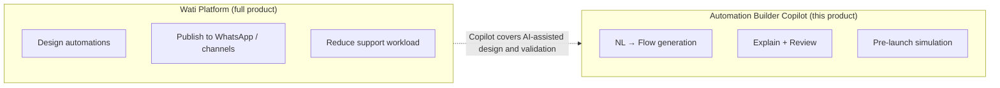
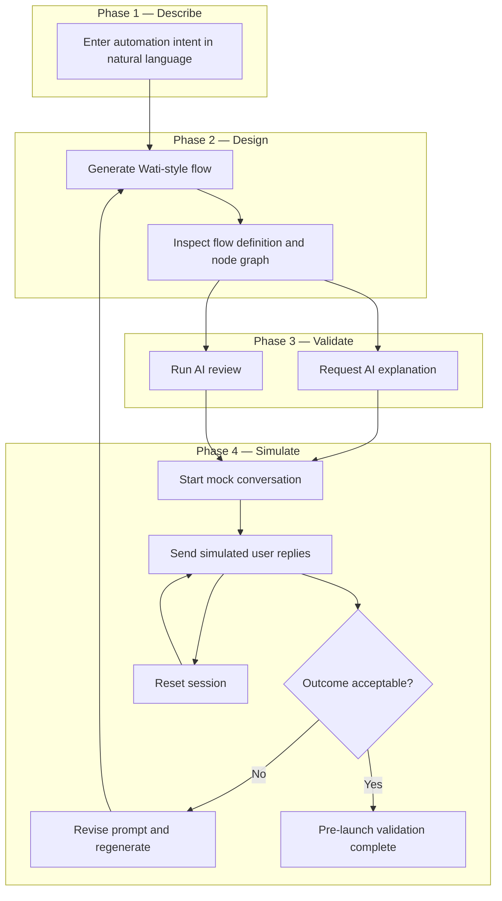
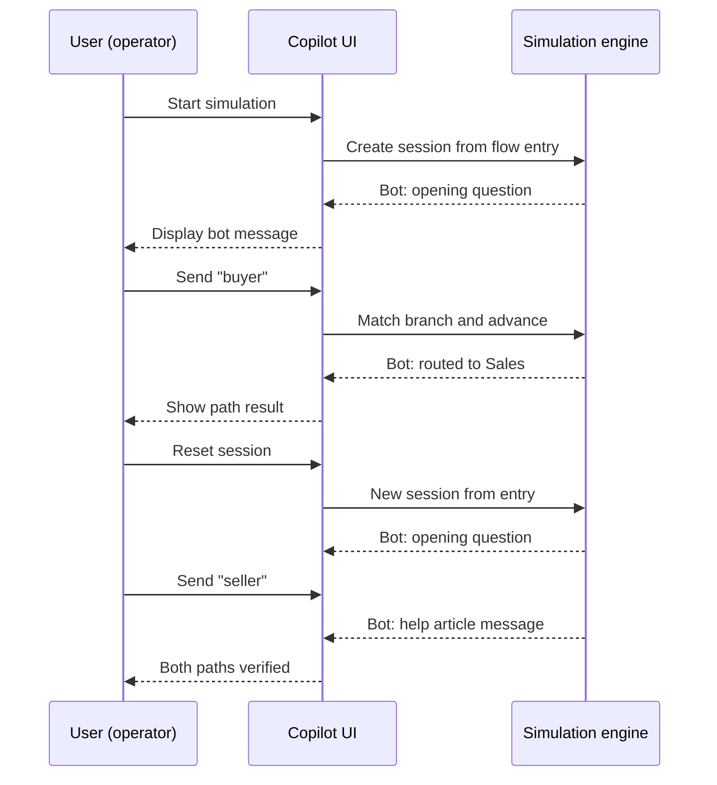
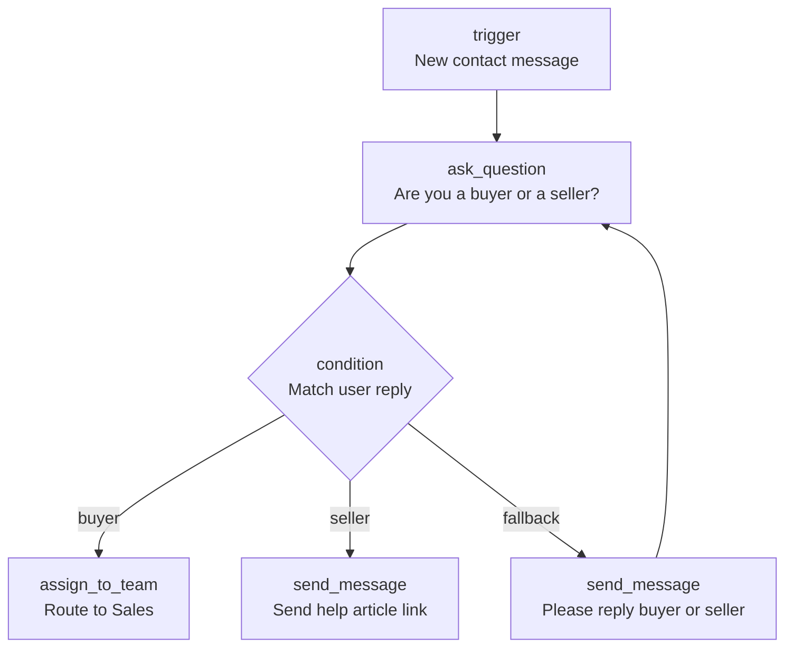

# Wati Automation Builder Copilot — Product Specification

> **Document type:** Product prototype & scope definition  
> **Version:** 1.0  
> **Status:** Approved for implementation

---

## 1. Executive Summary

**Wati Automation Builder Copilot** is an AI-assisted workflow design tool for Wati chatbot automations.

Users describe automation intent in **natural language**. The system produces a **Wati-compatible chatbot flow**, explains the logic in plain language, surfaces structural and semantic risks, and supports **pre-launch conversation simulation** — all before any flow is published to a live channel.

**Value proposition:** Reduce the time and expertise required to design, understand, and validate chatbot automations inside the Wati ecosystem.

---

## 2. Product Positioning

### 2.1 In Scope

| Dimension | Definition |
|-----------|------------|
| **Primary input** | Natural language description of automation intent |
| **Core artifact** | Structured flow (machine-readable definition + read-only node graph) |
| **AI capabilities** | Generation, explanation, and review |
| **Validation** | Multi-turn mock conversation with fallback handling and session reset |
| **Node vocabulary** | Aligned with Wati Chatbot Builder (send message, ask question, condition, etc.) |

### 2.2 Out of Scope (MVP)

| Excluded | Rationale |
|----------|-----------|
| Drag-and-drop visual editor | Copilot generates flows; manual node editing is not part of MVP |
| Publish / deploy to live channels | MVP covers design and pre-launch validation only |
| Wati API / WhatsApp integration | Requires production infrastructure beyond MVP |
| Persistent accounts and saved workflows | MVP focuses on a single-session design experience |
| AI-generated live chat at runtime | Simulation follows the designed flow predictably |

### 2.3 Relationship to the Wati Platform



The Copilot sits **upstream** of publish: it helps users design and verify flows before they are configured or deployed in Wati Chatbot Builder.

---

## 3. Target Users

### 3.1 Primary Personas

| Persona | Needs |
|---------|-------|
| **Operations / CS lead** | Build routing and FAQ bots without deep Builder expertise |
| **Small business owner** | Describe intent in plain language instead of configuring nodes manually |

### 3.2 Reference Scenarios

**Scenario A — Buyer / seller routing**

> When a new contact messages us, ask whether they are a buyer or seller. Route buyers to sales and send sellers a help article.

**Scenario B — FAQ routing**

> If the user asks about pricing, route to sales. If they ask about support, route to the support team and send an FAQ link.

**Scenario C — Incomplete flow (review stress test)**

> When someone messages, ask if they need sales or support. Route sales requests to the sales team.

Expected review findings: missing support branch, no fallback for ambiguous replies, incomplete user journey.

---

## 4. User Journey

### 4.1 Overview

The journey has four phases: **Describe → Design → Validate → Simulate**. Users may loop back to regeneration if review or simulation surfaces issues.



### 4.2 Step-by-Step Flow

| Step | User action | System response | UI panel |
|------|-------------|-----------------|----------|
| 1 | Enter or select a starter prompt | — | Prompt |
| 2 | Click **Generate** | Produces structured flow; renders node graph | Prompt → Flow |
| 3 | Review graph and flow definition | Read-only artifact available for inspection | Flow |
| 4 | Click **Explain** | Plain-language summary of trigger, branches, and outcomes | Flow |
| 5 | Click **Review** | Issue list with severity (errors, warnings, info) | Flow |
| 6 | Click **Start simulation** | Bot sends first message(s); session begins at entry node | Mock Chat |
| 7 | Type replies (e.g. `buyer`, `seller`) | Bot follows branches; shows actions and session state | Mock Chat |
| 8 | Click **Reset session** | Clears transcript; restarts from entry node | Mock Chat |
| 9 | If issues found, edit prompt and repeat from Step 2 | New flow replaces previous artifact | Prompt |

### 4.3 Simulation Sub-Journey

Once simulation starts, the user walks through one or more conversation paths before signing off on the flow.



### 4.4 Recommended Workflow

1. **Generate** — turn intent into a structured flow  
2. **Explain / Review** — confirm logic and catch gaps before simulating  
3. **Simulate** — test happy paths and edge cases (e.g. buyer, seller, unclear reply)  
4. **Reset / Regenerate** — reset to re-test; regenerate if the flow itself needs changes  

---

## 5. Feature Specification

### 5.1 MVP (P0)

| Feature | Description | Acceptance criteria |
|---------|-------------|---------------------|
| **Natural language input** | Text area with example prompts | User can type or select a starter prompt |
| **Flow generation** | Turn natural language into a Wati-style node flow | Valid flow with trigger, nodes, and branches |
| **Flow definition view** | Collapsible structured view of the generated flow | Same artifact drives graph and simulation |
| **Flow graph** | Read-only visual map of nodes and connections | Node types and paths are clearly identifiable |
| **AI explanation** | Plain-language flow summary | Non-technical users can understand bot behavior |
| **AI review** | Structural + semantic analysis | Detects missing branches, missing fallback, etc. |
| **Multi-turn simulation** | Mock chat through the flow | Supports ask → reply → branch → action sequences |
| **Fallback handling** | Unmatched input behavior | Uses fallback edge when defined; otherwise retry / clarify |
| **Session reset** | Reset simulation | Clears transcript and restarts from entry node |

### 5.2 Post-MVP (P1)

| Feature | Description |
|---------|-------------|
| UI polish | Closer visual alignment with Wati product patterns |
| Additional starter prompts | Broader scenario coverage |
| Curated example flows | Quick-start templates for common automations |

### 5.3 Explicitly Excluded

- Drag-and-drop node editing  
- Publish / deploy  
- Live channel integration  
- User accounts and login  
- Long-term flow library / versioning  

---

## 6. Interface Prototype

### 6.1 Layout — Three-Panel Workspace

```
┌────────────────────────────────────────────────────────────────┐
│  Wati Automation Builder Copilot                    [Reset All] │
├──────────────────┬─────────────────────────┬───────────────────┤
│ PROMPT           │ FLOW                    │ MOCK CHAT         │
│                  │                         │                   │
│ [textarea]       │ [Node graph]            │ conversation log  │
│ [Generate]       │                         │ [input] [Send]    │
│                  │ ─────────────────────── │ [Reset Session]   │
│ Example prompts: │ [Flow definition view]  │                   │
│ · buyer/seller   │                         │ ───────────────── │
│ · FAQ routing    │ [Explain] [Review]      │ Explanation panel │
│ · incomplete     │                         │ Review issues     │
└──────────────────┴─────────────────────────┴───────────────────┘
```

### 6.2 Panel Responsibilities

| Panel | User actions | System response |
|-------|--------------|-----------------|
| **Prompt** | Enter description, click Generate | Creates and stores flow |
| **Flow graph** | Read-only inspection | Visual map rendered from the generated flow |
| **Flow definition** | Expand / collapse | Full structured flow artifact |
| **Explain / Review** | Trigger analysis | Explanation text or issue list (severity + message) |
| **Mock Chat** | Send message, Reset | Bot replies, branch state, session status |

### 6.3 Interaction Principles

- **Single source of truth:** One generated flow drives both the visual map and simulation  
- **Understand before simulating:** Generate → Explain/Review → Simulate  
- **Read-only graph:** Flow changes are made by revising the prompt and regenerating  

---

## 7. Wati Node Model

Generated flows use vocabulary familiar to Wati Chatbot Builder users:

| Node type | Purpose | Example |
|-----------|---------|---------|
| `trigger` | Flow entry | New message, keyword match |
| `ask_question` | Prompt and wait for reply | "Are you a buyer or a seller?" |
| `condition` | Branch on reply or attribute | buyer → path A, seller → path B |
| `send_message` | Send a message | Help article link |
| `assign_to_team` | Route to a team | Sales, Support |
| `api_call` | External integration | Optional; represented in flow design |
| `wait` | Delay / timed wait | Optional |

### 7.1 Reference Flow — Buyer / Seller Routing

This is the canonical reference automation used across documentation, walkthroughs, and simulation examples.

**Source prompt**

> When a new contact messages us, ask if they are a buyer or a seller. Route buyers to the sales team and send sellers a link to our help article.

**Flow diagram**



**Node map**

| Node | Type | Purpose |
|------|------|---------|
| Entry | `trigger` | Starts when a new contact sends a message |
| Question | `ask_question` | Asks: "Are you a buyer or a seller?" |
| Router | `condition` | Routes by reply: buyer, seller, or fallback |
| Sales handoff | `assign_to_team` | Routes buyer to the Sales team |
| Seller response | `send_message` | Sends help article link to seller |
| Clarification | `send_message` | Prompts user to reply buyer or seller |

**Paths**

| From | To | When |
|------|-----|------|
| Entry | Question | New conversation starts |
| Question | Router | User has been asked |
| Router | Sales handoff | User reply indicates buyer |
| Router | Seller response | User reply indicates seller |
| Router | Clarification | Reply is unclear |
| Clarification | Question | User is asked again |

**Expected simulation paths**

| Path | User replies | Expected bot behavior | End state |
|------|--------------|----------------------|-----------|
| Buyer | `"buyer"` | Acknowledges and routes to Sales | `handed_off` |
| Seller | `"seller"` | Sends help article link | `completed` |
| Unclear | `"hello"` → `"buyer"` | Clarification prompt, then re-ask; routes on valid reply | `handed_off` |

**Review expectations**

A well-formed version of this flow should pass structural review (all branches reachable, fallback present, terminal paths defined). Review should flag flows that omit the seller path, skip fallback, or leave `ask_question` without valid exits.

### 7.2 Flow Structure

Every generated automation is composed of:

- **Flow** — name, source prompt, entry point, and full set of nodes and connections  
- **Node** — a single step (type, label, and step-specific settings such as message text or team name)  
- **Connection** — links two nodes and may include a condition (e.g. buyer, seller, fallback)  

---

## 8. Pre-Launch Simulation

### 8.1 Definition

**Pre-launch simulation** runs the generated flow inside a mock chat environment using simulated user messages. It validates that runtime behavior matches design intent — without connecting to WhatsApp or any live channel.

Simulation is **not** open-ended AI chat. The system follows the designed flow step by step so outcomes are consistent and reviewable.

### 8.2 Runtime Behavior

| Event | System behavior |
|-------|-----------------|
| Start simulation | Begin at entry node; auto-run non-interactive nodes; pause at `ask_question` |
| User reply matches a branch | Follow the matching condition edge |
| User reply does not match | Follow `fallback` edge if present; otherwise retry with clarification |
| Terminal node reached | Session status → `completed` or `handed_off` |
| Reset session | New session ID, cleared transcript, restart from entry |

### 8.3 Simulation vs. Review

| | Simulation | Review |
|--|------------|--------|
| **Method** | Execute the flow | Analyze the flow structure |
| **Answers** | "If the user says buyer, what happens next?" | "Support branch is missing — high risk" |
| **Validates** | Execution correctness | Design completeness |

---

## 9. AI Capabilities

### 9.1 What AI Does — and What It Does Not

| Capability | Role | User-facing outcome |
|------------|------|---------------------|
| **Flow generation** | AI | Turns a plain-language brief into a structured Wati-style flow |
| **Flow explanation** | AI | Summarizes trigger, branches, and outcomes in plain language |
| **Flow review** | AI + built-in checks | Surfaces missing branches, weak fallback, and UX risks |
| **Simulation** | Rule-based execution | Walks the flow exactly as designed — not improvised AI chat |

**Product principle:** AI supports **design and validation**. Simulation reflects the **approved flow**, not a separate conversational model.

### 9.2 Review — Two Layers

**Structural checks:**

- Unreachable steps  
- Missing fallback on branching questions  
- Paths that never resolve  
- Questions with no valid next step  
- Broken or incomplete connections  

**Semantic review (AI-assisted):**

- Ambiguous branching logic  
- Missing business paths (e.g. sales handled, support ignored)  
- User experience and safety risks  

---

## 10. End-to-End Walkthrough

| Step | Scenario | Expected outcome |
|------|----------|------------------|
| 1 | Buyer / seller routing | Flow generated; graph and definition visible; both paths simulate correctly |
| 2 | FAQ routing | Demonstrates generalization across a second prompt |
| 3 | Incomplete sales/support flow | Review flags missing branch and fallback; simulation may expose dead ends |

---

## 11. Product Decisions

- [x] Natural language as primary input; no drag-and-drop editor in MVP  
- [x] Output: structured flow definition + read-only node graph  
- [x] AI: generation, explanation, and review  
- [x] Simulation: multi-turn, fallback, session reset  
- [x] Reference scenario with intentional gaps to validate review quality  
- [x] No publish or live channel integration in MVP  

---