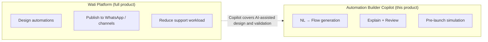
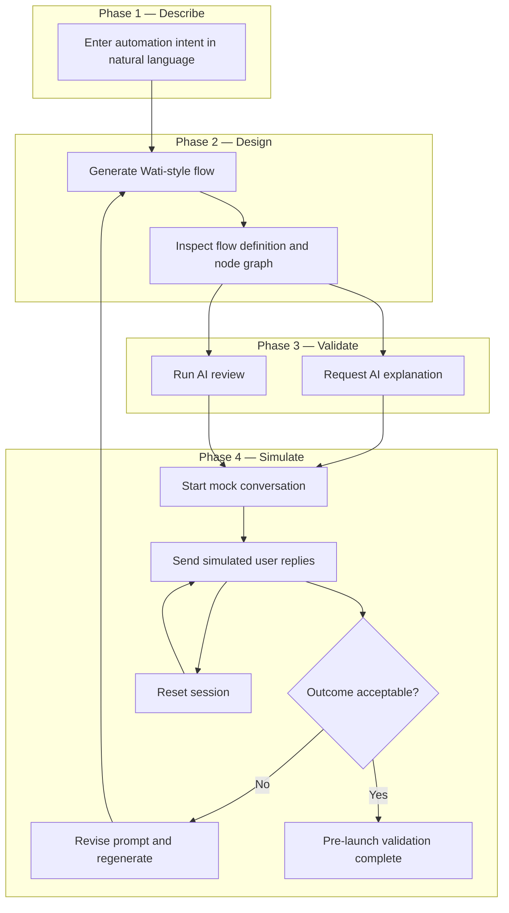
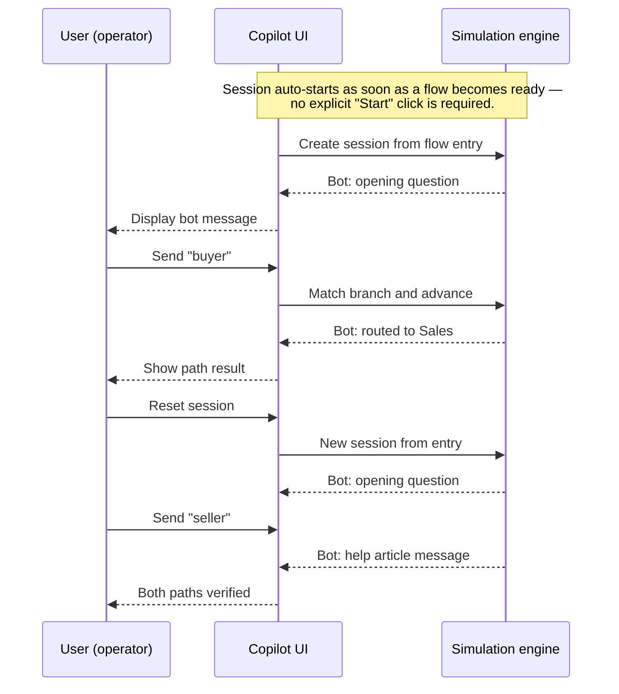
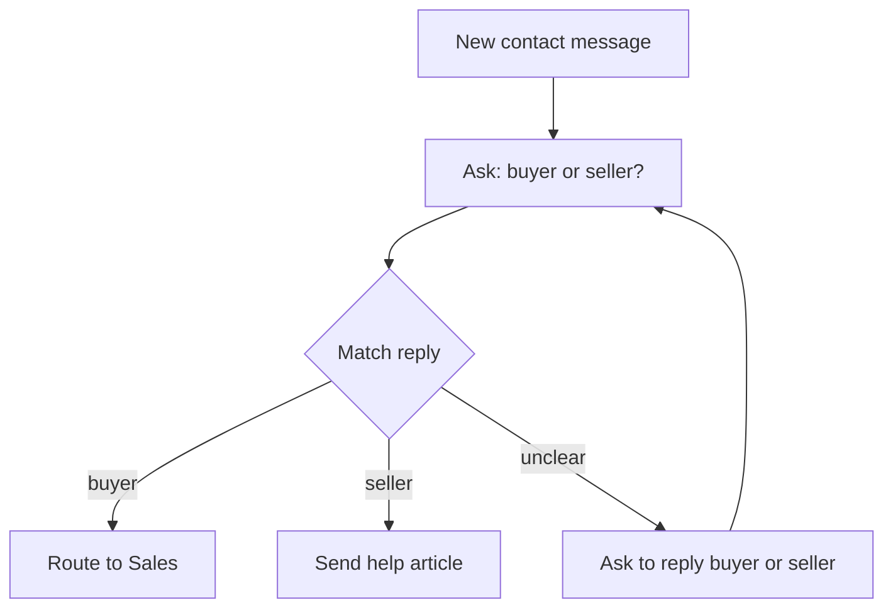

# Wati Automation Builder Copilot — Product Specification

> **Document type:** Product prototype & scope definition  
> **Version:** 1.0  
> **Status:** Specification locked; implementation complete (demo pending — see [BUILD_PLAN.md](./BUILD_PLAN.md) Phase 6)

---

## 1. Executive Summary

**Wati Automation Builder Copilot** is an AI-assisted workflow design tool for Wati chatbot automations.

Users describe automation intent in **natural language**. The system produces a **Wati-compatible chatbot flow**, explains the logic in plain language, surfaces structural and semantic risks, and supports **pre-launch conversation simulation** — all before any flow is published to a live channel.

**Value proposition:** Reduce the time and expertise required to design, understand, and validate chatbot automations inside the Wati ecosystem.

---

## 2. Product Positioning

### 2.1 In Scope

| Dimension           | Definition                                                                                                                                                                       |
| ------------------- | -------------------------------------------------------------------------------------------------------------------------------------------------------------------------------- |
| **Primary input**   | Natural language description of automation intent                                                                                                                                |
| **Core artifact**   | Structured flow (machine-readable definition + read-only node graph)                                                                                                             |
| **AI capabilities** | Generation, explanation, and review                                                                                                                                              |
| **Validation**      | Multi-turn mock conversation with fallback handling and session reset                                                                                                            |
| **Node vocabulary** | Aligned with Wati Chatbot Builder: `trigger`, `send_message`, `ask_question`, `condition`, `assign_to_team`, `api_call`, `wait` (see [docs/data-model.md](./docs/data-model.md)) |

### 2.2 Out of Scope (MVP)

| Excluded                                | Rationale                                                       |
| --------------------------------------- | --------------------------------------------------------------- |
| Drag-and-drop visual editor             | Copilot generates flows; manual node editing is not part of MVP |
| Publish / deploy to live channels       | MVP covers design and pre-launch validation only                |
| Wati API / WhatsApp integration         | Requires production infrastructure beyond MVP                   |
| Persistent accounts and saved workflows | MVP focuses on a single-session design experience               |
| AI-generated live chat at runtime       | Simulation follows the designed flow predictably                |

### 2.3 Relationship to the Wati Platform



The Copilot sits **upstream** of publish: it helps users design and verify flows before they are configured or deployed in Wati Chatbot Builder.

---

## 3. Target Users

### 3.1 Primary Personas

| Persona                  | Needs                                                                   |
| ------------------------ | ----------------------------------------------------------------------- |
| **Operations / CS lead** | Build routing and FAQ bots without deep Builder expertise               |
| **Small business owner** | Describe intent in plain language instead of configuring nodes manually |

### 3.2 Reference Scenarios

**Scenario A — Buyer / seller routing**

> When a new contact messages us, ask whether they are a buyer or seller. Route buyers to sales and send sellers a help article.

**Scenario B — FAQ routing**

> If the user asks about pricing, route to sales. If they ask about support, route to the support team and send an FAQ link.

**Scenario C — Incomplete flow (review stress test)**

> When someone messages, ask if they need sales or support. Route sales requests to the sales team.

Expected review findings: missing support branch, no fallback for ambiguous replies, incomplete user journey.

---

## 4. User Journey

### 4.1 Overview

The journey has four phases: **Describe → Design → Validate → Simulate**. Users may loop back to regeneration if review or simulation surfaces issues.



### 4.2 Step-by-Step Flow

| Step | User action                                           | System response                                                                                                | UI panel      |
| ---- | ----------------------------------------------------- | -------------------------------------------------------------------------------------------------------------- | ------------- |
| 1    | Enter or select a starter prompt                      | —                                                                                                              | Prompt        |
| 2    | Click **Generate**                                    | Produces structured flow; renders node graph (auto-laid-out)                                                   | Prompt → Flow |
| 2b   | _(automatic)_                                         | Mock simulation session is created against the new flow; the bot sends its opening message                     | Mock Chat     |
| 3    | Review the graph or toggle to JSON                    | Read-only artifact available for inspection                                                                    | Flow          |
| 4    | Click **Explain**                                     | Plain-language markdown summary of trigger, branches, and outcomes                                             | Flow          |
| 5    | Click **Review**                                      | Issue list with severity (errors, warnings, info); click an issue to highlight the affected nodes in the graph | Flow          |
| 6    | Type replies (e.g. `buyer`, `seller`)                 | Bot follows branches; shows actions and session state                                                          | Mock Chat     |
| 7    | Click **Reset**                                       | Clears transcript; restarts from entry node, same session id                                                   | Mock Chat     |
| 8    | If issues found, edit prompt and click Generate again | New flow + new simulation replaces previous artifact                                                           | Prompt        |

### 4.3 Simulation Sub-Journey

Once simulation starts, the user walks through one or more conversation paths before signing off on the flow.



### 4.4 Recommended Workflow

1. **Generate** — turn intent into a structured flow
2. **Explain / Review** — confirm logic and catch gaps before simulating
3. **Simulate** — test happy paths and edge cases (e.g. buyer, seller, unclear reply)
4. **Reset / Regenerate** — reset to re-test; regenerate if the flow itself needs changes

---

## 5. Feature Specification

### 5.1 MVP (P0)

| Feature                    | Description                                       | Acceptance criteria                                        |
| -------------------------- | ------------------------------------------------- | ---------------------------------------------------------- |
| **Natural language input** | Text area with example prompts                    | User can type or select a starter prompt                   |
| **Flow generation**        | Turn natural language into a Wati-style node flow | Valid flow with trigger, nodes, and branches               |
| **Flow definition view**   | Collapsible structured view of the generated flow | Same artifact drives graph and simulation                  |
| **Flow graph**             | Read-only visual map of nodes and connections     | Node types and paths are clearly identifiable              |
| **AI explanation**         | Plain-language flow summary                       | Non-technical users can understand bot behavior            |
| **AI review**              | Structural + semantic analysis                    | Detects missing branches, missing fallback, etc.           |
| **Multi-turn simulation**  | Mock chat through the flow                        | Supports ask → reply → branch → action sequences           |
| **Fallback handling**      | Unmatched input behavior                          | Uses fallback edge when defined; otherwise retry / clarify |
| **Session reset**          | Reset simulation                                  | Clears transcript and restarts from entry node             |

### 5.2 Post-MVP (P1)

| Feature                    | Description                                        |
| -------------------------- | -------------------------------------------------- |
| UI polish                  | Closer visual alignment with Wati product patterns |
| Additional starter prompts | Broader scenario coverage                          |
| Curated example flows      | Quick-start templates for common automations       |

### 5.3 Explicitly Excluded

- Drag-and-drop node editing
- Publish / deploy
- Live channel integration
- User accounts and login
- Long-term flow library / versioning

---

## 6. Interface

Three-panel layout: **Prompt** (left) · **Flow** (center) · **Mock Chat** (right).

```
┌──────────────────────────────────────────────────────────────┐
│  Wati Automation Builder Copilot                             │
├──────────────┬──────────────────────────────┬────────────────┤
│ PROMPT       │ FLOW                         │ MOCK CHAT      │
│ [textarea]   │ [Explain][Review][View JSON] │ transcript     │
│ [Generate]   │ ┌──────── node graph ──────┐ │ [Send] [Reset] │
│ examples ▾   │ │  trigger → ask → branch  │ │                │
│              │ └──────────────────────────┘ │                │
└──────────────┴──────────────────────────────┴────────────────┘
```

- One generated flow drives the graph, JSON view, review, and simulation.
- The Flow panel defaults to **Graph**; toggle to JSON for the raw structure.
- Users change the flow by editing the prompt and regenerating — not by dragging nodes.
- **Generate** in Prompt; **Explain** / **Review** / **View JSON** in Flow; **Send** / **Reset** in Mock Chat.
- Mock Chat auto-starts as soon as a flow is ready — no explicit "Start" button.

---

## 7. Reference Flow — Buyer / Seller Routing

Canonical example for QA and walkthroughs.

**Prompt**

> When a new contact messages us, ask if they are a buyer or a seller. Route buyers to the sales team and send sellers a link to our help article.

**Flow**



**Node types used:** `trigger`, `ask_question`, `condition`, `assign_to_team`, `send_message`

| Test          | User input        | Expected result                    |
| ------------- | ----------------- | ---------------------------------- |
| Buyer path    | `buyer`           | Routed to Sales                    |
| Seller path   | `seller`          | Help article sent                  |
| Unclear reply | `hello` → `buyer` | Clarification, then route to Sales |

Review must pass on a complete version of this flow; must fail if seller path or fallback is missing.

---

## 8. Simulation & Review

**Simulation** runs the designed flow step by step in mock chat — not open-ended conversation. Pauses on questions; follows branches on match; uses fallback or clarification when reply is unclear; **Reset** restarts from entry. `api_call` nodes are accepted in generated flows but executed as mocks during simulation — no real HTTP request is made.

**Review** returns findings with severity (`error`, `warning`, `info`):

- **Structural:** unreachable steps, missing fallback, broken connections
- **Semantic:** missing business paths, ambiguous routing

|                   | Review                         | Simulation                             |
| ----------------- | ------------------------------ | -------------------------------------- |
| Question answered | "What's wrong with this flow?" | "What happens if the user says buyer?" |

**Generation, explanation, and review** use AI. **Simulation** follows the flow as built.

---

## 9. MVP Decisions

- Natural language in; no canvas editor
- Output: flow definition + read-only node graph
- Multi-turn simulation with fallback and session reset
- No publish or live channel integration
- Scenarios B (FAQ) and C (incomplete flow) used to test generalization and review

---
