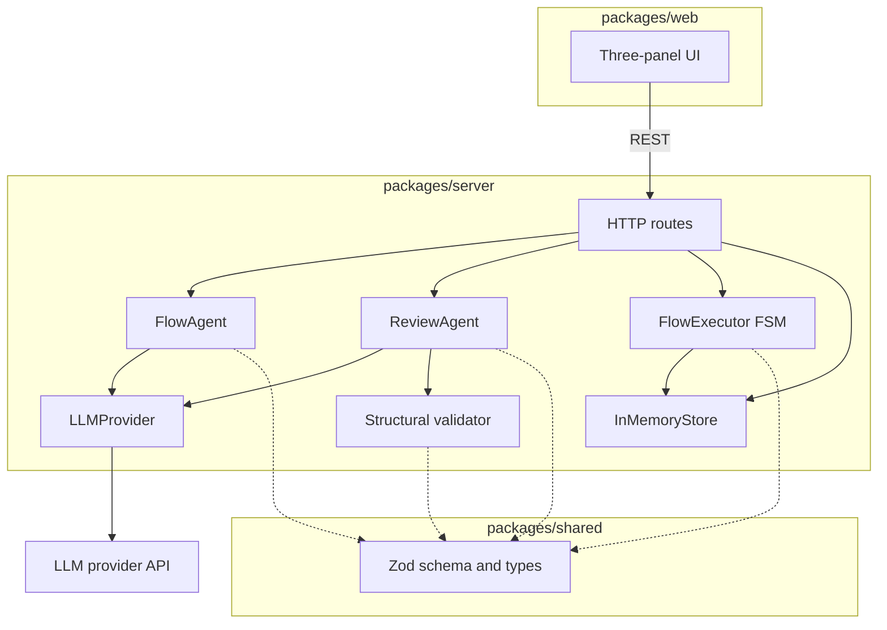
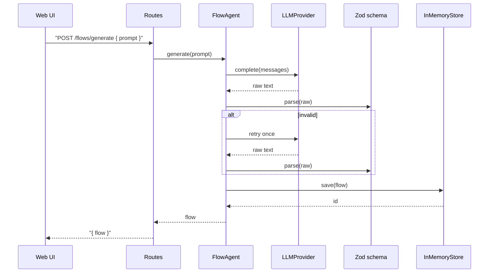
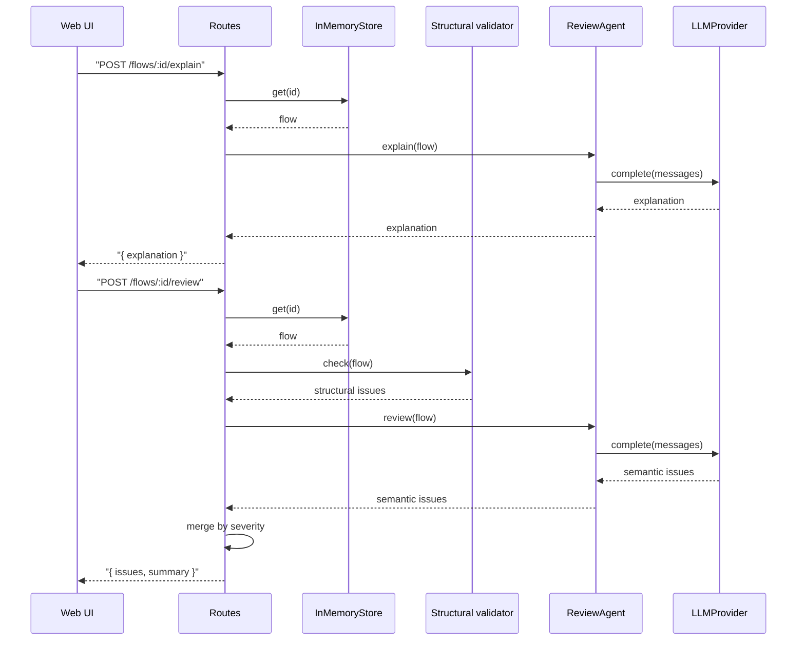
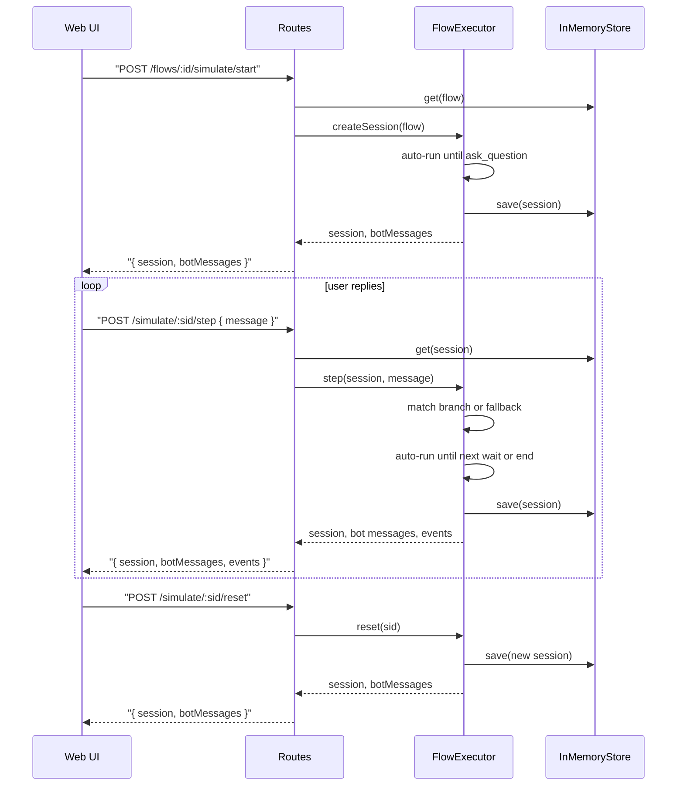

# Wati Automation Builder Copilot

> AI-assisted design and pre-launch validation for Wati chatbot automations.

---

## Status

**Pre-implementation.** This README captures the planned product, architecture, and API surface. The runtime scaffold (server, web, shared packages) is not yet in place; a Quick Start section will be added once the project boots.

For the product specification, see [PRODUCT.md](./PRODUCT.md).

---

## Overview

**Wati Automation Builder Copilot** lets operators describe a chatbot automation in plain English and turns it into a Wati-compatible flow. The system explains the resulting logic, reviews it for defects and gaps, and runs a deterministic mock conversation so the design can be walked through before any flow is published.

The Copilot sits **upstream of publish** — design and validate first, then configure the approved flow in the Wati Builder.

**Primary users:** customer operations and CS leads, plus small business owners configuring routing and FAQ bots.

---

## Scope

| In scope (MVP) | Out of scope (MVP) |
|----------------|--------------------|
| Natural-language input with starter examples | Drag-and-drop visual editor |
| Generation of a Wati-style flow from a brief | Publish or deploy to live channels |
| Read-only node graph + structured flow view | Wati API / WhatsApp integration |
| AI: generate, explain, review | Accounts, login, saved workflows |
| Multi-turn mock simulation with fallback and reset | Persistent storage and flow library |
| Hybrid review (structural + AI semantic) | AI-authored runtime chat replies |

See [PRODUCT.md](./PRODUCT.md) for full details and rationale.

---

## Design Principles

### Product & architecture

1. **Design-time AI only.** Generate / explain / review use the LLM. Simulation is deterministic.
2. **Hybrid review.** Code catches structural defects; the LLM catches semantic ones. Findings merge with severity.
3. **Single source of truth.** One flow drives the graph, the structured view, and the executor.
4. **Shared schema.** One Zod type for backend, frontend, and LLM output.

### Engineering

5. **SOLID.** Modules depend on interfaces (`LLMProvider`), not vendor SDKs.
6. **Unified configuration.** All tunables in one env-driven layer; no scattered constants.
7. **Minimise external calls.** Stored flows are reused across endpoints; retry is bounded.
8. **Defence in depth.** Validate inputs, constrain LLM outputs, keep secrets server-only, log metadata not content. See [.cursor/rules/security.mdc](./.cursor/rules/security.mdc).

---

## Design Decisions

| Decision | Rationale |
|----------|-----------|
| TypeScript monorepo (over Python or polyglot) | Shared Flow types and Zod schema across server + web + validation |
| In-memory storage only | MVP is single-session; persistence is out of scope |
| `LLMProvider` interface; DeepSeek as the default | Swap models without changing agent code; provider chosen via env |
| Read-only React Flow graph (no editing canvas) | Operators describe intent in prompts; flow changes happen by regeneration |
| Deterministic FSM executor (not LLM-driven simulation) | Reproducible mock chat; review and demo behavior are predictable |
| Hybrid review (rules + LLM) | Structural rules cannot be hallucinated; the model adds judgment, not correctness |

---

## Tech Stack

| Layer | Choice | Reason |
|-------|--------|--------|
| Language | TypeScript | Shared types across backend, frontend, and validation |
| Monorepo | pnpm workspaces (`shared` / `server` / `web`) | One repo, one schema |
| Backend | Fastify | Lightweight JSON API |
| Frontend | React + Vite + `@xyflow/react` | Standard SPA with read-only flow graph |
| Validation | Zod | One source of types for API and LLM output |
| LLM | DeepSeek `deepseek-chat` via `LLMProvider` interface | Provider-agnostic; DeepSeek is the default adapter |

---

## Architecture

### Module overview



Three packages share one Flow schema. Agents and the executor depend on the schema; the executor never imports the LLM layer.

### Generate flow



### Explain and review



### Simulate



The executor is deterministic. The LLM is never invoked during a simulation step.

---

## API Reference

Base URL: `/api`. JSON in, JSON out. Two resources — **Flow** and **Simulation**. Errors share one shape ([Errors](#errors)). Examples use the buyer / seller reference flow from [PRODUCT.md](./PRODUCT.md).

### Flow

A Flow is the structured representation of a chatbot automation generated from a natural-language prompt. Generated once and reused by every subsequent endpoint.

**Fields**

| Field | Type | Description |
|-------|------|-------------|
| `id` | string | Unique identifier (`flow_...`) |
| `name` | string | Human-readable name derived from the prompt |
| `prompt` | string | Original natural-language input |
| `trigger` | object | `{ type, value? }` where `type` is `new_message` or `keyword` |
| `entryNodeId` | string | Starting node ID |
| `nodes` | Node[] | Flow steps; see Node below |
| `edges` | Edge[] | Connections; see Edge below |
| `createdAt` | string | ISO 8601 timestamp |

**Node**

| Field | Type | Description |
|-------|------|-------------|
| `id` | string | Unique identifier |
| `type` | enum | `trigger`, `send_message`, `ask_question`, `condition`, `assign_to_team`, `api_call`, `wait` |
| `label` | string | Display label |
| `config` | object | Type-specific settings (message text, team name, condition rules) |
| `position` | object | Optional graph coordinates `{ x, y }` |

**Edge**

| Field | Type | Description |
|-------|------|-------------|
| `id` | string | Unique identifier |
| `from` | string | Source node ID |
| `to` | string | Target node ID |
| `condition` | string | Optional branch label (`buyer`, `seller`, `fallback`, ...) |

**Endpoints**

| Method | URL | Body | Response | Status |
|--------|-----|------|----------|--------|
| `POST` | `/api/flows/generate` | `{ prompt }` | `{ flow }` | 200 · 400 · 422 · 502 |
| `GET` | `/api/flows/:id` | — | `{ flow }` | 200 · 404 |
| `POST` | `/api/flows/:id/explain` | — | `{ explanation }` | 200 · 404 · 502 |
| `POST` | `/api/flows/:id/review` | — | `{ issues, summary }` | 200 · 404 · 502 |

**Issue** (returned by `/review`)

| Field | Type | Description |
|-------|------|-------------|
| `severity` | enum | `error`, `warning`, or `info` |
| `code` | string | Stable code, e.g. `MISSING_FALLBACK`, `UNREACHABLE_NODE` |
| `message` | string | Human-readable explanation |
| `nodeIds` | string[] | Affected nodes, when applicable |

**Example — `POST /api/flows/generate`**

```http
POST /api/flows/generate
Content-Type: application/json

{
  "prompt": "When a new contact messages us, ask if they are a buyer or a seller. Route buyers to the sales team and send sellers our help article."
}
```

```json
{
  "flow": {
    "id": "flow_01h...",
    "name": "Buyer / seller routing",
    "prompt": "When a new contact messages us, ...",
    "trigger": { "type": "new_message" },
    "entryNodeId": "n0",
    "nodes": [
      { "id": "n0", "type": "trigger", "label": "New contact message", "config": {} },
      { "id": "n1", "type": "ask_question", "label": "Buyer or seller?", "config": { "text": "Are you a buyer or a seller?" } },
      { "id": "n2", "type": "condition", "label": "Match reply", "config": {} },
      { "id": "n3", "type": "assign_to_team", "label": "Route to Sales", "config": { "team": "sales" } },
      { "id": "n4", "type": "send_message", "label": "Help article", "config": { "text": "Here is our help article: https://..." } }
    ],
    "edges": [
      { "id": "e0", "from": "n0", "to": "n1" },
      { "id": "e1", "from": "n1", "to": "n2" },
      { "id": "e2", "from": "n2", "to": "n3", "condition": "buyer" },
      { "id": "e3", "from": "n2", "to": "n4", "condition": "seller" }
    ],
    "createdAt": "2026-05-23T07:50:00Z"
  }
}
```

### Simulation

A Simulation is a session that walks through a Flow step by step in a mock chat. Created from a Flow, advanced by user messages, and can be reset to start over.

**Session fields**

| Field | Type | Description |
|-------|------|-------------|
| `id` | string | Session identifier (`sess_...`) |
| `flowId` | string | Source flow |
| `currentNodeId` | string | Currently active node |
| `status` | enum | `running`, `waiting_for_input`, `completed`, `handed_off` |
| `transcript` | Message[] | Ordered bot and user messages |
| `context.retryCount` | number | Times the current question has been re-asked |
| `context.lastQuestionNodeId` | string | Most recent question node |

**Message**

| Field | Type | Description |
|-------|------|-------------|
| `role` | enum | `bot` or `user` |
| `content` | string | Message text |
| `nodeId` | string | Source node (bot messages only) |
| `timestamp` | string | ISO 8601 |

**Endpoints**

| Method | URL | Body | Response | Status |
|--------|-----|------|----------|--------|
| `POST` | `/api/flows/:id/simulate/start` | — | `{ session, botMessages }` | 200 · 404 |
| `POST` | `/api/simulate/:sessionId/step` | `{ message }` | `{ session, botMessages, events }` | 200 · 400 · 404 |
| `POST` | `/api/simulate/:sessionId/reset` | — | `{ session, botMessages }` | 200 · 404 |

**Example — `POST /api/simulate/:sessionId/step`**

```http
POST /api/simulate/sess_01h.../step
Content-Type: application/json

{ "message": "buyer" }
```

```json
{
  "session": {
    "id": "sess_01h...",
    "flowId": "flow_01h...",
    "currentNodeId": "n3",
    "status": "handed_off",
    "transcript": [
      { "role": "bot", "content": "Are you a buyer or a seller?", "nodeId": "n1", "timestamp": "..." },
      { "role": "user", "content": "buyer", "timestamp": "..." },
      { "role": "bot", "content": "Routing you to Sales.", "nodeId": "n3", "timestamp": "..." }
    ],
    "context": { "retryCount": 0 }
  },
  "botMessages": ["Routing you to Sales."],
  "events": [
    { "type": "branch", "from": "n2", "to": "n3", "condition": "buyer" }
  ]
}
```

### Errors

All errors share one shape:

```json
{
  "error": {
    "code": "FLOW_NOT_FOUND",
    "message": "No flow with id flow_xyz"
  }
}
```

| HTTP | Code | When |
|------|------|------|
| 400 | `INVALID_INPUT` | Request body fails Zod validation |
| 404 | `FLOW_NOT_FOUND`, `SESSION_NOT_FOUND` | Unknown id |
| 422 | `LLM_OUTPUT_INVALID` | Model output failed schema after retry |
| 502 | `LLM_UNAVAILABLE` | Provider error or timeout |
