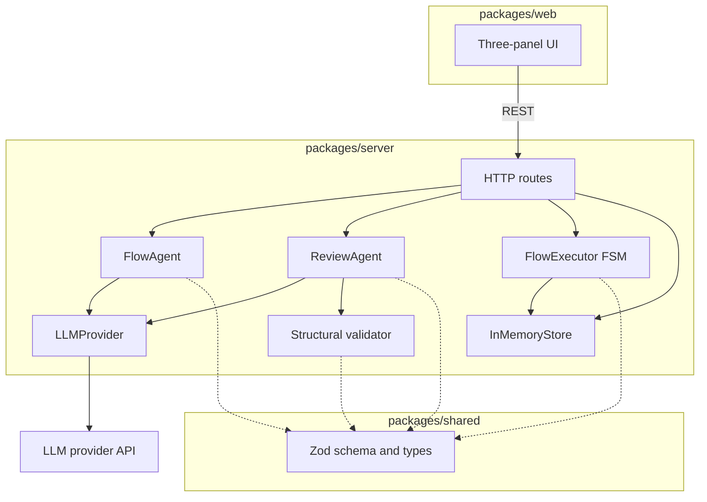

# Wati Automation Builder Copilot

> AI-assisted design and pre-launch validation for Wati chatbot automations.

---

## Status

**Pre-implementation.** This README captures the planned product, architecture, and API surface. The runtime scaffold (server, web, shared packages) is not yet in place; a Quick Start section will be added once the project boots.

For the product specification, see [PRODUCT.md](./PRODUCT.md).

---

## Overview

**Wati Automation Builder Copilot** lets operators describe a chatbot automation in plain English and turns it into a Wati-compatible flow. The system explains the resulting logic, reviews it for defects and gaps, and runs a deterministic mock conversation so the design can be walked through before any flow is published.

The Copilot sits **upstream of publish** — design and validate first, then configure the approved flow in the Wati Builder.

**Primary users:** customer operations and CS leads, plus small business owners configuring routing and FAQ bots.

---

## Scope

| In scope (MVP) | Out of scope (MVP) |
|----------------|--------------------|
| Natural-language input with starter examples | Drag-and-drop visual editor |
| Generation of a Wati-style flow from a brief | Publish or deploy to live channels |
| Read-only node graph + structured flow view | Wati API / WhatsApp integration |
| AI: generate, explain, review | Accounts, login, saved workflows |
| Multi-turn mock simulation with fallback and reset | Persistent storage and flow library |
| Hybrid review (structural + AI semantic) | AI-authored runtime chat replies |

See [PRODUCT.md](./PRODUCT.md) for full details and rationale.

---

## Design Principles

### Product & architecture

1. **Design-time AI only.** Generate / explain / review use the LLM. Simulation is deterministic.
2. **Hybrid review.** Code catches structural defects; the LLM catches semantic ones. Findings merge with severity.
3. **Single source of truth.** One flow drives the graph, the structured view, and the executor.
4. **Shared schema.** One Zod type for backend, frontend, and LLM output.

### Engineering

5. **SOLID.** Modules depend on interfaces (`LLMProvider`), not vendor SDKs.
6. **Unified configuration.** All tunables in one env-driven layer; no scattered constants.
7. **Minimise external calls.** Stored flows are reused across endpoints; retry is bounded.
8. **Defence in depth.** Validate inputs, constrain LLM outputs, keep secrets server-only, log metadata not content. See [.cursor/rules/security.mdc](./.cursor/rules/security.mdc).

---

## Design Decisions

| Decision | Rationale |
|----------|-----------|
| TypeScript monorepo (over Python or polyglot) | Shared Flow types and Zod schema across server + web + validation |
| In-memory storage only | MVP is single-session; persistence is out of scope |
| `LLMProvider` interface; DeepSeek as the default | Swap models without changing agent code; provider chosen via env |
| Read-only React Flow graph (no editing canvas) | Operators describe intent in prompts; flow changes happen by regeneration |
| Deterministic FSM executor (not LLM-driven simulation) | Reproducible mock chat; review and demo behavior are predictable |
| Hybrid review (rules + LLM) | Structural rules cannot be hallucinated; the model adds judgment, not correctness |

---

## Tech Stack

| Layer | Choice | Reason |
|-------|--------|--------|
| Language | TypeScript | Shared types across backend, frontend, and validation |
| Monorepo | pnpm workspaces (`shared` / `server` / `web`) | One repo, one schema |
| Backend | Fastify | Lightweight JSON API |
| Frontend | React + Vite + `@xyflow/react` | Standard SPA with read-only flow graph |
| Validation | Zod | One source of types for API and LLM output |
| LLM | DeepSeek `deepseek-chat` via `LLMProvider` interface | Provider-agnostic; DeepSeek is the default adapter |

---

## Architecture

### Module overview

Three packages share one Flow schema. Agents and the executor depend on the schema; the executor never imports the LLM layer.

### Runtime flows

- **Generate** — `FlowAgent` calls the `LLMProvider`, validates the response against the Zod schema (one retry on failure), and stores the flow.
- **Explain & review** — both load the stored flow. `explain` is LLM-only. `review` runs the structural validator and the `ReviewAgent` in parallel and merges findings by severity.
- **Simulate** — the deterministic FSM executor walks the flow; the LLM is never called during a step.

See [docs/architecture.md](./docs/architecture.md) for the full sequence diagrams.

---

## Data Model & API

Two resources: **Flow** (the generated automation, with nodes and edges) and **Simulation** (a session walking through a flow). Review findings come back as typed issues with severity.

See [docs/data-model.md](./docs/data-model.md) for entity fields, REST endpoints, request/response examples, status codes, and the shared error shape.
