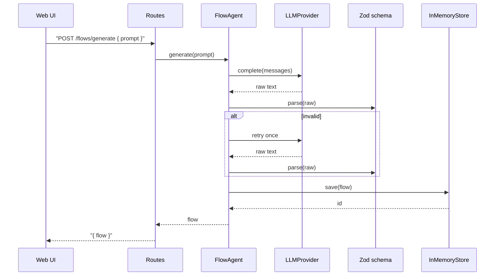
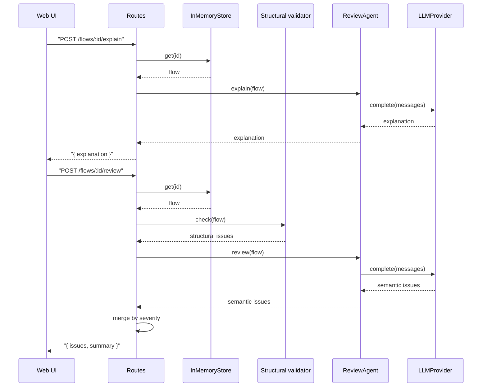
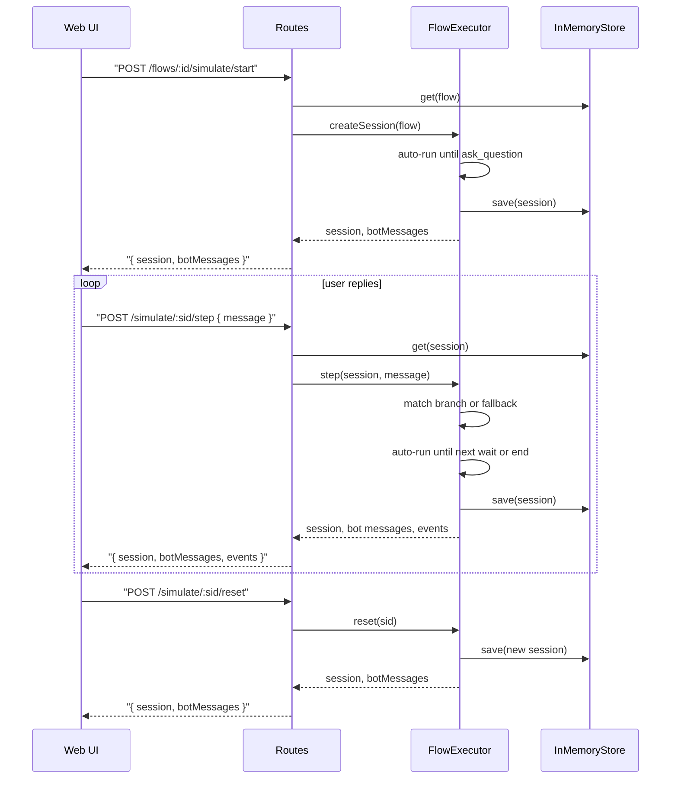

# Architecture — Runtime Flows

Sequence diagrams for each runtime path through the system. For the package layout and the system map, see the **Architecture** section in [../README.md](../README.md).

Two invariants hold across every flow:

- One Zod-typed Flow drives the graph, the structured view, and the executor.
- The executor is deterministic. The LLM is never invoked during a simulation step.

---

## Generate

`POST /api/flows/generate` — natural-language prompt in, validated Flow out. One retry on schema failure.

---

## Explain and review

Both endpoints load the stored flow. `explain` is LLM-only. `review` runs the structural validator and the `ReviewAgent` in parallel and merges findings by severity.

---

## Simulate

A session walks through a Flow step by step. The executor auto-runs until it hits an `ask_question` or terminal node; user replies advance it. The LLM is not involved.

